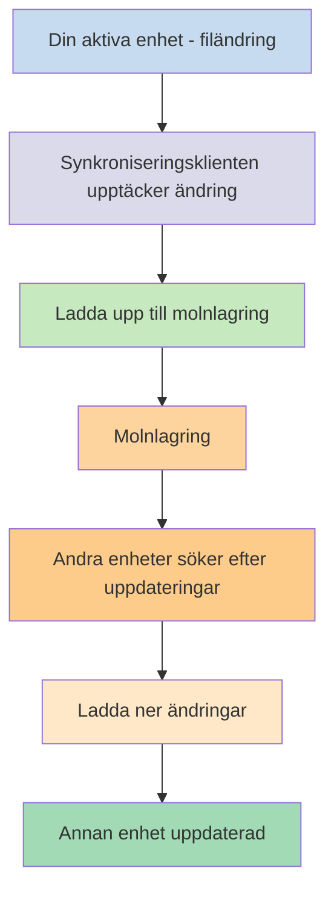
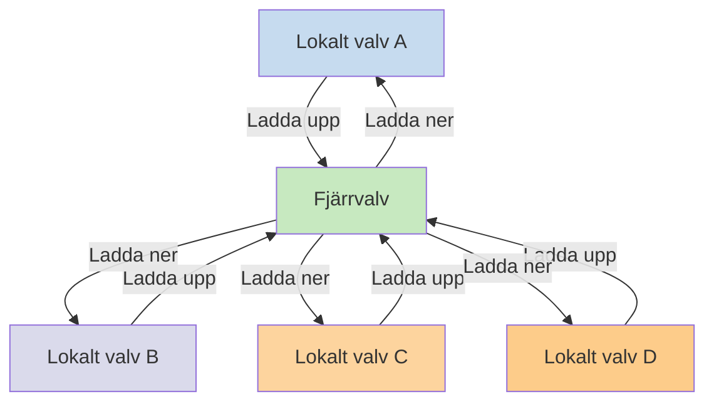

Om du vill använda dina anteckningar på olika enheter är ett av alternativen att [[Synkronisera dina anteckningar mellan enheter]]. Obsidian erbjuder en sådan tjänst, [[Introduktion till Obsidian Sync|Obsidian Sync]], som fungerar annorlunda jämfört med andra synkroniseringstjänster, som [[Synkronisera dina anteckningar mellan enheter#iCloud|iCloud]] och [[Synkronisera dina anteckningar mellan enheter#OneDrive|OneDrive]].

Här är några nyckeltermer:

- Ett **valv** är en mapp i ditt filsystem som innehåller anteckningar och en `.obsidian`-mapp med Obsidian-specifik konfiguration.
- Ett **lokalt valv** är kopian av ditt valv som finns på var och en av dina enheter. När du använder synkroniseringstjänster kopplar du ihop dessa lokala valv för att möjliggöra synkronisering.
- Ett **fjärrvalv** är centraliserad lagring som lokala valv ansluter till direkt genom Obsidian Sync.

Det finns två vanliga metoder för synkronisering:

- **[[#Filbaserade synkroniseringstjänster]]**: Lokala valv måste finnas i övervakade mappar, synkronisering sker via filsystemet
- **[[#Obsidian Sync|Fjärrvalv]]**: Centraliserad lagring som lokala valv ansluter till direkt genom Obsidian

## Filbaserade synkroniseringstjänster

Tjänster som Dropbox, Google Drive, iCloud och OneDrive är mappbaserade. Dessa tjänster övervakar specifika mappar och synkroniserar automatiskt alla filer som placeras i dem. Filer måste finnas i de angivna molntjänstmapparna för att synkroniseras. Med filbaserade synkroniseringstjänster fungerar ditt lokala valv som bara ytterligare en mapp som övervakas. Det finns inget dedikerat fjärrvalv – istället fungerar molnlagringen som en genomgång och kopierar filer mellan lokala valv på olika enheter.

Diagrammet nedan visar en förenklad version av hur dessa tjänster fungerar:

Om molntjänsten har bakgrundssynkronisering kan vissa av dessa processer pågå även när du inte aktivt använder applikationerna för att visa filerna. Dessa tjänster övervakar specifika mappar och synkroniserar automatiskt alla filer som placeras i dem. Filer måste finnas i de angivna molntjänstmapparna för att synkroniseras.

## Obsidian Sync

Obsidian Sync låter dig skapa ett fjärrvalv som fungerar som centraliserad lagring genom dess [[Introduktion till Obsidian Sync|Obsidian Sync]]-tjänst. Detta gör att du kan välja nästan vilken mapp som helst på vilken enhet som helst för att lagra dina filer – oavsett om det är på en extern hårddisk, i `C:\`, eller i applagring på Android.

Vi har dock en lista med rekommenderade platser för ditt lokala valv om du också använder [[#Filbaserade synkroniseringstjänster]] på samma enhet – huvudsakligen var som helst som inte är i en [[Byt till Obsidian Sync#Flytta ditt valv ut från din synkroniseringstjänst från tredje part eller molnlagring|synkroniseringstjänst från tredje part]].

Diagrammet nedan visar en förenklad version av hur Obsidian Sync fungerar:

Styrkan i detta system blir mer uppenbar med fler enhetstyper. [[#Filbaserade synkroniseringstjänster]] kan implementeras inkonsekvent mellan operativsystem, och mobila enheter har sina egna regler för hur applikationer kan sandboxas och strömbegränsas, vilket gör det mycket svårare för traditionella filbaserade tjänster att fungera sömlöst.

Med Obsidian Sync hanterar tjänsten synkronisering direkt genom applikationen, vilket ger konsekvent beteende oavsett enhetstyp eller operativsystembegränsningar, samtidigt som den prioriterar att behålla en lokal kopia av dina data som en [[Säkerhetskopiera dina Obsidian-filer|mjuk säkerhetskopia]].

### Synkroniseringsbeteende

När du gör ändringar i filer i ditt lokala valv upptäcker Obsidian Sync dessa ändringar och laddar upp dem till fjärrvalvet. Andra enheter anslutna till samma fjärrvalv laddar sedan ner dessa ändringar och tillämpar dem på sina lokala valv. Obsidian Sync spårar ändringar på filnivå och överför bara de filer som har ändrats, istället för att synkronisera hela mappar. Detta minskar bandbreddsanvändning och synkroniseringstid.

När konflikter uppstår eller när du behöver kontrollera vilka filer som synkroniseras tillhandahåller Obsidian Sync specifika mekanismer för att hantera dessa situationer:

![[Felsök Obsidian Sync#Konfliktlösning|Konfliktlösning]]

![[Synkroniseringsinställningar och selektiv synkronisering#Selektiv synkronisering#Exkludera en mapp från synkronisering]]

### Offlinebeteende

Ändringar som görs offline köas och synkroniseras automatiskt när din enhet återansluter till internet och Obsidian är öppet. Ditt lokala valv förblir fullt funktionellt under offlineperioder.

## Nästa steg

- [[Konfigurera Obsidian Sync]] för att komma igång med fjärrvalv.
- [[Byt till Obsidian Sync]] om du för närvarande använder filbaserad synkronisering och vill använda Obsidian Sync.
- [[Synkronisera dina anteckningar mellan enheter|Utforska andra synkroniseringsalternativ]] om du fortfarande bestämmer dig.
