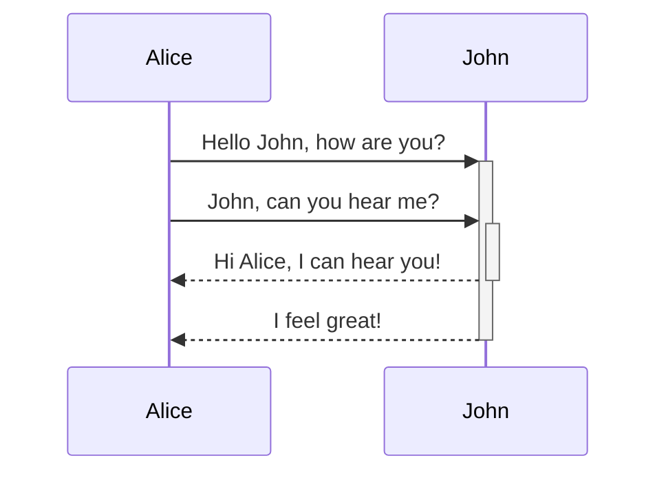
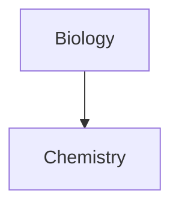

Lär dig hur du lägger till avancerad formateringssyntax i dina anteckningar.

## Tabeller

Du kan skapa tabeller med hjälp av lodräta streck (`|`) för att separera kolumner och bindestreck (`-`) för att definiera rubriker. Här är ett exempel:

```md
| Förnamn | Efternamn |
| ------- | --------- |
| Max     | Planck    |
| Marie   | Curie     |
```

| Förnamn | Efternamn |
| ------- | --------- |
| Max     | Planck    |
| Marie   | Curie     |

Även om de lodräta strecken på vardera sidan av tabellen är valfria, rekommenderas det att inkludera dem för läsbarhetens skull.

> [!tip] I _live-förhandsvisning_ kan du högerklicka på en tabell för att lägga till eller radera kolumner och rader. Du kan också sortera och flytta dem via snabbmenyn.

Du kan infoga en tabell med kommandot **Infoga tabell** från [[Kommandopalett|Kommandopaletten]] eller genom att högerklicka och välja _Infoga → Tabell_. Detta ger dig en grundläggande, redigerbar tabell:

```md
|     |     |
| --- | --- |
|     |     |
```

Observera att celler inte behöver vara perfekt justerade, men rubrikraden måste innehålla minst två bindestreck:

```md
Förnamn | Efternamn
-- | --
Max | Planck
Marie | Curie
```


### Formatera innehåll i en tabell

Du kan använda [[Grundläggande formateringssyntax]] för att stila innehåll i en tabell.

| Första kolumnen       | Andra kolumnen                              |
| --------------------- | ------------------------------------------- |
| [[Interna länkar]]    | Länka till en fil _inom_ ditt **valv**.     |
| [[Bädda in filer]]    | ![[Engelbart.jpg\|100]]                     |

> [!note] Lodräta streck i tabeller
> Om du vill använda [[Aliaser|aliaser]], eller [[Grundläggande formateringssyntax#Externa bilder|ändra storlek på en bild]] i din tabell, behöver du lägga till ett `\` före det lodräta strecket.
>
> ```md
> Första kolumnen | Andra kolumnen
> -- | --
> [[Grundläggande formateringssyntax\|Markdown-syntax]] | ![[Engelbart.jpg\|200]]
> ```
>
> Första kolumnen | Andra kolumnen
> -- | --
> [[Grundläggande formateringssyntax\|Markdown-syntax]] | ![[Engelbart.jpg\|200]]

Justera text i kolumner genom att lägga till kolon (`:`) i rubrikraden. Du kan också justera innehåll i _live-förhandsvisning_ via snabbmenyn.

```md
Vänsterjusterad text | Centrerad text | Högerjusterad text
:-- | :--: | --:
Innehåll | Innehåll | Innehåll
```

Vänsterjusterad text | Centrerad text | Högerjusterad text
:-- | :--: | --:
Innehåll | Innehåll | Innehåll

## Diagram

Du kan lägga till diagram och grafer i dina anteckningar med hjälp av [Mermaid](https://mermaid-js.github.io/). Mermaid stöder en rad olika diagram, såsom [flödesscheman](https://mermaid.js.org/syntax/flowchart.html), [sekvensdiagram](https://mermaid.js.org/syntax/sequenceDiagram.html) och [tidslinjer](https://mermaid.js.org/syntax/timeline.html).

> [!tip] Tips
> Du kan också prova Mermaids [Live Editor](https://mermaid-js.github.io/mermaid-live-editor) för att hjälpa dig bygga diagram innan du inkluderar dem i dina anteckningar.

För att lägga till ett Mermaid-diagram, skapa ett `mermaid` [[Grundläggande formateringssyntax#Kodblock|kodblock]].

````md

````


````md

````


### Länka filer i ett diagram

Du kan skapa [[Interna länkar|interna länkar]] i dina diagram genom att koppla klassen `internal-link` ([class](https://mermaid.js.org/syntax/flowchart.html#classes)) till dina noder.

````md

````


> [!note] Observera
> Interna länkar från diagram visas inte i [[Grafvy|grafvyn]].

Om du har många noder i dina diagram kan du använda följande kodsnutt.

````md

````

På detta sätt blir varje bokstavsnod en intern länk, med [nodtexten](https://mermaid.js.org/syntax/flowchart.html#a-node-with-text) som länktext.

> [!note] Observera
> Om du använder specialtecken i dina anteckningsnamn behöver du sätta anteckningsnamnet inom dubbla citattecken.
>
> ```
> class "⨳ special character" internal-link
> ```
>
> Eller, `A["⨳ special character"]`.

För mer information om att skapa diagram, se den [officiella Mermaid-dokumentationen](https://mermaid.js.org/intro/).

## Matematik

Du kan lägga till matematiska uttryck i dina anteckningar med hjälp av [MathJax](http://docs.mathjax.org/en/latest/basic/mathjax.html) och LaTeX-notation.

För att lägga till ett MathJax-uttryck i din anteckning, omge det med dubbla dollartecken (`$$`).

```md
$$
\begin{vmatrix}a & b\\
c & d
\end{vmatrix}=ad-bc
$$
```

$$
\begin{vmatrix}a & b\\
c & d
\end{vmatrix}=ad-bc
$$

Du kan också använda inline-matematikuttryck genom att omge dem med `$`-tecken.

```md
Detta är ett inline-matematikuttryck $e^{2i\pi} = 1$.
```

Detta är ett inline-matematikuttryck $e^{2i\pi} = 1$.

För mer information om syntaxen, se [MathJax basic tutorial and quick reference](https://math.meta.stackexchange.com/questions/5020/mathjax-basic-tutorial-and-quick-reference).

För en lista över MathJax-paket som stöds, se [The TeX/LaTeX Extension List](http://docs.mathjax.org/en/latest/input/tex/extensions/index.html).
