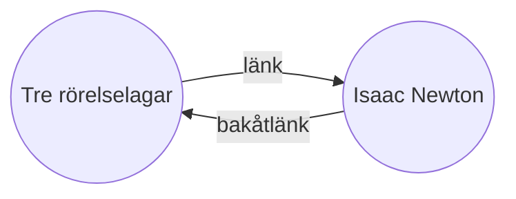

Med kärntillägget [[Bakåtlänkar|Bakåtlänkar]] kan du se alla _bakåtlänkar_ för den aktiva anteckningen.

En bakåtlänk för en anteckning är en länk från en annan anteckning till den anteckningen. I följande exempel innehåller anteckningen "Tre rörelselagar" en länk till anteckningen "Isaac Newton". Motsvarande bakåtlänk skulle länka från "Isaac Newton" tillbaka till "Tre rörelselagar".

Bakåtlänkar kan vara användbara för att hitta anteckningar som refererar till den anteckning du skriver. Tänk dig om du kunde lista bakåtlänkarna för vilken webbplats som helst på internet.

## Visa bakåtlänkar

Tillägget Bakåtlänkar visar bakåtlänkarna för de aktiva flikarna. Det finns två hopfällbara sektioner: **Länkade omnämnanden** och **Olinkade omnämnanden**.

- **Länkade omnämnanden** är bakåtlänkar till anteckningar som innehåller en intern länk till den aktiva anteckningen.
- **Olinkade omnämnanden** är bakåtlänkar till varje olänkad förekomst av den aktiva anteckningens namn.

Det erbjuder följande alternativ:

- **Kollapsa resultat** växlar om varje anteckning ska expanderas för att visa omnämnandena i den.
- **Visa mer sammanhang** växlar om det fullständiga stycket som innehåller omnämnandet ska visas eller trunkeras.
- **Ändra sorteringsordning** bestämmer hur omnämnandena ska sorteras.
- **Visa sökfilter** växlar ett textfält som låter dig filtrera omnämnandena. För mer information om hur du bygger ett sökuttryck, se [[Sök]].

## Visa bakåtlänkar för en anteckning

För att visa bakåtlänkarna för den aktiva anteckningen, klicka på fliken **Bakåtlänkar** ![[obsidian-icon-links-coming-in.svg#icon]] i höger sidofält.

> [!note] Notera
> Om du inte kan se fliken Bakåtlänkar kan du göra den synlig genom att öppna [[Kommandopalett|kommandopaletten]] och köra kommandot **Bakåtlänkar: Visa bakåtlänkar**.

> [!info] Exkluderade filer
> Filer som matchar dina mönster för [[Inställningar#Exkluderade filer|Exkluderade filer]] kommer inte att visas i Olinkade omnämnanden.

## Se bakåtlänkar för en specifik anteckning

Fliken för bakåtlänkar listar bakåtlänkar för den aktiva anteckningen och uppdateras när du byter till en annan anteckning. Om du vill se bakåtlänkarna för en specifik anteckning, oavsett om den är aktiv eller inte, kan du öppna en _länkad_ bakåtlänksflik.

För att öppna en länkad bakåtlänksflik:

1. Öppna [[Kommandopalett|kommandopaletten]].
2. Välj **Bakåtlänkar: Öppna bakåtlänkar för aktuell fil**.

En separat flik öppnas bredvid din aktiva anteckning. Fliken visar en länkikon för att visa att den är länkad till en anteckning.

## Visa bakåtlänkar i en anteckning

Istället för att visa bakåtlänkarna i en separat flik kan du visa bakåtlänkarna längst ner i din anteckning.

För att visa bakåtlänkar i en anteckning:

1. Öppna [[Kommandopalett|kommandopaletten]].
2. Välj **Bakåtlänkar: Växla bakåtlänkar i dokument**.

Eller aktivera **Bakåtlänkar i dokument** under tilläggsinställningarna för Bakåtlänkar för att automatiskt växla bakåtlänkar när du öppnar en ny anteckning.
