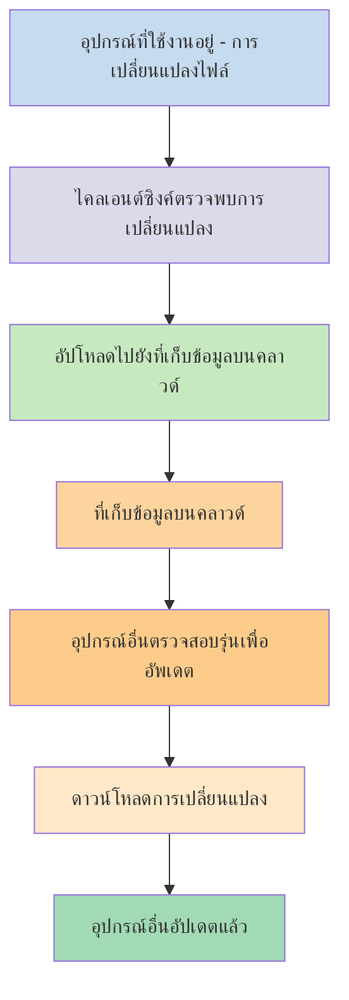
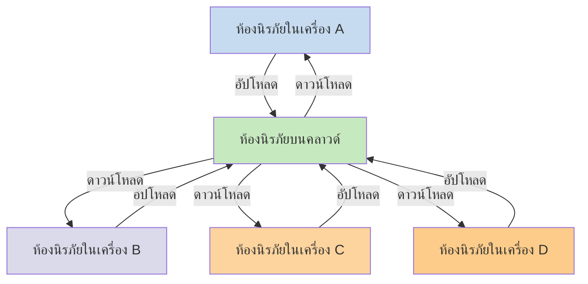

หากคุณต้องการใช้โน้ตของคุณบนอุปกรณ์ต่างๆ หนึ่งในตัวเลือกที่คุณมีคือการ[[ซิงค์โน้ตของคุณข้ามอุปกรณ์]] Obsidian มีบริการดังกล่าว คือ [[แนะนำ Obsidian Sync|Obsidian Sync]] ซึ่งทำงานต่างจากบริการซิงค์อื่นๆ เช่น [[ซิงค์โน้ตของคุณข้ามอุปกรณ์#iCloud|iCloud]] และ [[ซิงค์โน้ตของคุณข้ามอุปกรณ์#OneDrive|OneDrive]]

นี่คือคำศัพท์สำคัญบางคำ:

- **ห้องนิรภัย** คือโฟลเดอร์ในระบบไฟล์ของคุณที่ประกอบด้วยโน้ตและโฟลเดอร์ `.obsidian` ที่มีการตั้งค่าเฉพาะของ Obsidian
- **ห้องนิรภัยในเครื่อง** คือสำเนาของห้องนิรภัยที่มีอยู่ในแต่ละอุปกรณ์ของคุณ เมื่อใช้บริการซิงค์ คุณจะเชื่อมต่อห้องนิรภัยในเครื่องเหล่านี้เพื่อเปิดใช้งานการซิงโครไนซ์
- **ห้องนิรภัยบนคลาวด์** คือที่เก็บข้อมูลส่วนกลางที่ห้องนิรภัยในเครื่องเชื่อมต่อโดยตรงผ่าน Obsidian Sync

มีสองแนวทางทั่วไปสำหรับการซิงค์:

- **[[#บริการซิงค์แบบไฟล์]]**: ห้องนิรภัยในเครื่องต้องอยู่ในโฟลเดอร์ที่ถูกตรวจสอบ การซิงค์เกิดขึ้นผ่านระบบไฟล์
- **[[#Obsidian Sync|ห้องนิรภัยบนคลาวด์]]**: ที่เก็บข้อมูลส่วนกลางที่ห้องนิรภัยในเครื่องเชื่อมต่อโดยตรงผ่าน Obsidian

## บริการซิงค์แบบไฟล์

บริการอย่าง Dropbox, Google Drive, iCloud และ OneDrive เป็นแบบอิงโฟลเดอร์ บริการเหล่านี้ตรวจสอบโฟลเดอร์เฉพาะและซิงค์ไฟล์ที่อยู่ภายในโดยอัตโนมัติ ไฟล์ต้องอยู่ในโฟลเดอร์ของบริการคลาวด์ที่กำหนดจึงจะซิงค์ได้ เมื่อใช้บริการซิงค์แบบไฟล์ ห้องนิรภัยในเครื่องของคุณทำหน้าที่เป็นเพียงอีกโฟลเดอร์หนึ่งที่ถูกตรวจสอบ ไม่มีห้องนิรภัยบนคลาวด์โดยเฉพาะ แต่ที่เก็บข้อมูลบนคลาวด์ทำหน้าที่เป็นตัวกลาง คัดลอกไฟล์ระหว่างห้องนิรภัยในเครื่องบนอุปกรณ์ต่างๆ

แผนภาพด้านล่างแสดงเวอร์ชันแบบง่ายของวิธีการทำงานของบริการเหล่านี้:

หากบริการคลาวด์มีการซิงค์เบื้องหลัง กระบวนการบางส่วนเหล่านี้อาจเกิดขึ้นแม้ว่าคุณจะไม่ได้ใช้งานแอปพลิเคชันเพื่อดูไฟล์อยู่ก็ตาม บริการเหล่านี้ตรวจสอบโฟลเดอร์เฉพาะและซิงค์ไฟล์ที่อยู่ภายในโดยอัตโนมัติ ไฟล์ต้องอยู่ในโฟลเดอร์ของบริการคลาวด์ที่กำหนดจึงจะซิงค์ได้

## Obsidian Sync

Obsidian Sync ช่วยให้คุณสร้างห้องนิรภัยบนคลาวด์ที่ทำหน้าที่เป็นที่เก็บข้อมูลส่วนกลางผ่านบริการ [[แนะนำ Obsidian Sync|Obsidian Sync]] สิ่งนี้ช่วยให้คุณเลือกโฟลเดอร์เกือบทุกที่บนอุปกรณ์ใดก็ได้เพื่อเก็บไฟล์ของคุณ ไม่ว่าจะเป็นบนฮาร์ดไดรฟ์ภายนอก ใน `C:\` หรือในที่เก็บข้อมูลของแอปบน Android

อย่างไรก็ตาม เรามีรายการตำแหน่งที่แนะนำสำหรับห้องนิรภัยในเครื่องของคุณหากคุณใช้ [[#บริการซิงค์แบบไฟล์]] บนอุปกรณ์เดียวกันด้วย โดยหลักๆ คือที่ใดก็ได้ที่ไม่ได้อยู่ใน[[เปลี่ยนมาใช้ Obsidian Sync#ย้ายห้องนิรภัยของคุณออกจากบริการซิงค์ของบุคคลที่สามหรือที่จัดเก็บบนคลาวด์|บริการซิงค์ของบุคคลที่สาม]]

แผนภาพด้านล่างแสดงเวอร์ชันแบบง่ายของวิธีการทำงานของ Obsidian Sync:

จุดแข็งของระบบนี้จะเห็นได้ชัดเจนขึ้นเมื่อมีอุปกรณ์หลายประเภท [[#บริการซิงค์แบบไฟล์]] อาจถูกนำไปใช้งานอย่างไม่สม่ำเสมอในระบบปฏิบัติการต่างๆ และอุปกรณ์มือถือมีกฎของตัวเองเกี่ยวกับวิธีที่แอปพลิเคชันถูกแซนด์บ็อกซ์และจำกัดพลังงาน ซึ่งทำให้บริการซิงค์แบบไฟล์แบบดั้งเดิมทำงานได้อย่างราบรื่นยากขึ้นมาก

ด้วย Obsidian Sync บริการจะจัดการการซิงโครไนซ์โดยตรงผ่านแอปพลิเคชัน ให้พฤติกรรมที่สม่ำเสมอไม่ว่าจะเป็นอุปกรณ์ประเภทใดหรือข้อจำกัดของระบบปฏิบัติการ ในขณะเดียวกันก็ให้ความสำคัญกับการเก็บสำเนาข้อมูลในเครื่องเป็น[[สำรองข้อมูลไฟล์ Obsidian ของคุณ|การสำรองข้อมูลแบบอ่อน]]

### พฤติกรรมการซิงค์

เมื่อคุณทำการเปลี่ยนแปลงไฟล์ในห้องนิรภัยในเครื่อง Obsidian Sync จะตรวจพบการเปลี่ยนแปลงเหล่านี้และอัปโหลดไปยังห้องนิรภัยบนคลาวด์ อุปกรณ์อื่นที่เชื่อมต่อกับห้องนิรภัยบนคลาวด์เดียวกันจะดาวน์โหลดการเปลี่ยนแปลงเหล่านี้และนำไปใช้กับห้องนิรภัยในเครื่องของตน Obsidian Sync ติดตามการเปลี่ยนแปลงในระดับไฟล์และถ่ายโอนเฉพาะไฟล์ที่ถูกแก้ไขเท่านั้น แทนที่จะซิงค์ทั้งโฟลเดอร์ สิ่งนี้ช่วยลดการใช้แบนด์วิดท์และเวลาในการซิงค์

เมื่อเกิดข้อขัดแย้งหรือเมื่อคุณต้องการควบคุมว่าไฟล์ใดจะซิงค์ Obsidian Sync มีกลไกเฉพาะเพื่อจัดการสถานการณ์เหล่านี้:

![[แก้ไขปัญหา Obsidian Sync#การแก้ไขข้อขัดแย้ง|การแก้ไขข้อขัดแย้ง]]

![[การตั้งค่า Sync และเลือกซิงค์บางไฟล์#เลือกซิงค์บางไฟล์#ยกเว้นโฟลเดอร์จากการซิงค์]]

### พฤติกรรมขณะออฟไลน์

การเปลี่ยนแปลงที่ทำขณะออฟไลน์จะถูกเข้าคิวและซิงค์โดยอัตโนมัติเมื่ออุปกรณ์ของคุณเชื่อมต่อกับอินเทอร์เน็ตอีกครั้งและ Obsidian เปิดอยู่ ห้องนิรภัยในเครื่องของคุณยังคงใช้งานได้อย่างเต็มที่ในช่วงที่ออฟไลน์

## ขั้นตอนถัดไป

- [[ตั้งค่า Obsidian Sync]] เพื่อเริ่มต้นใช้งานห้องนิรภัยบนคลาวด์
- [[เปลี่ยนมาใช้ Obsidian Sync]] หากคุณกำลังใช้การซิงค์แบบไฟล์อยู่และต้องการใช้ Obsidian Sync
- [[ซิงค์โน้ตของคุณข้ามอุปกรณ์|สำรวจตัวเลือกการซิงค์อื่นๆ]] หากคุณยังตัดสินใจไม่ได้
