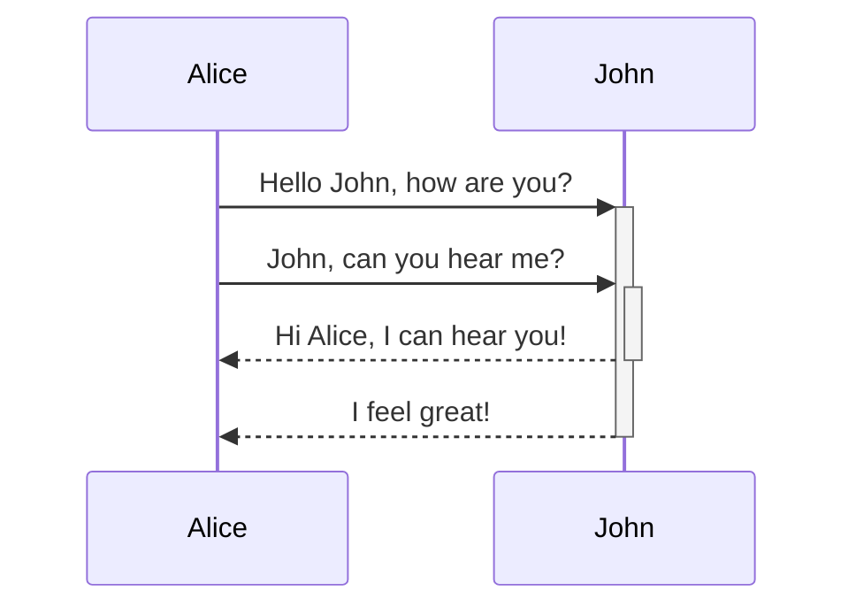
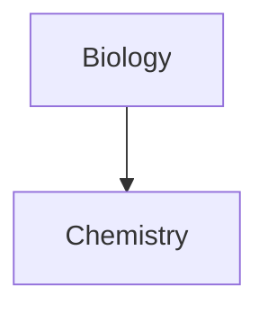

เรียนรู้วิธีเพิ่มไวยากรณ์การจัดรูปแบบขั้นสูงให้กับโน้ตของคุณ

## ตาราง

คุณสามารถสร้างตารางโดยใช้เส้นตั้ง (`|`) เพื่อแยกคอลัมน์ และเครื่องหมายขีด (`-`) เพื่อกำหนดส่วนหัว ตัวอย่างดังนี้:

```md
| First name | Last name |
| ---------- | --------- |
| Max        | Planck    |
| Marie      | Curie     |
```

| First name | Last name |
| ---------- | --------- |
| Max        | Planck    |
| Marie      | Curie     |

แม้ว่าเส้นตั้งทั้งสองข้างของตารางจะเป็นทางเลือก แต่แนะนำให้ใส่ไว้เพื่อความอ่านง่าย

> [!tip] ใน _แสดงตัวอย่างแบบสด_ คุณสามารถคลิกขวาที่ตารางเพื่อเพิ่มหรือลบคอลัมน์และแถว คุณยังสามารถจัดเรียงและย้ายได้โดยใช้เมนูบริบท

คุณสามารถแทรกตารางโดยใช้คำสั่ง **แทรกตาราง** จาก[[กระดานคำสั่ง]] หรือโดยคลิกขวาแล้วเลือก _Insert → Table_ ซึ่งจะให้ตารางพื้นฐานที่แก้ไขได้:

```md
|     |     |
| --- | --- |
|     |     |
```

โปรดทราบว่าเซลล์ไม่จำเป็นต้องจัดแนวสมบูรณ์แบบ แต่แถวส่วนหัวต้องมีเครื่องหมายขีดอย่างน้อยสองตัว:

```md
First name | Last name
-- | --
Max | Planck
Marie | Curie
```


### จัดรูปแบบเนื้อหาภายในตาราง

คุณสามารถใช้[[ไวยากรณ์การจัดรูปแบบพื้นฐาน]]เพื่อจัดสไตล์เนื้อหาภายในตาราง

| คอลัมน์แรก            | คอลัมน์ที่สอง                                   |
| ------------------ | --------------------------------------- |
| [[ลิงค์ภายใน]] | ลิงก์ไปยังไฟล์_ภายใน_**ห้องนิรภัย**ของคุณ |
| [[ฝังไฟล์]]    | ![[Engelbart.jpg\|100]]                 |

> [!note] เส้นตั้งในตาราง
> หากคุณต้องการใช้[[นามแฝง]] หรือ[[ไวยากรณ์การจัดรูปแบบพื้นฐาน#รูปภาพภายนอก|ปรับขนาดรูปภาพ]]ในตาราง คุณต้องเพิ่ม `\` ก่อนเส้นตั้ง
>
> ```md
> First column | Second column
> -- | --
> [[ไวยากรณ์การจัดรูปแบบพื้นฐาน\|Markdown syntax]]|[[ไวยากรณ์การจัดรูปแบบพื้นฐาน\|Markdown syntax]] | ![[Engelbart.jpg\|200]]
> ```
>
> First column | Second column
> -- | --
> [[ไวยากรณ์การจัดรูปแบบพื้นฐาน\|Markdown syntax]]|[[ไวยากรณ์การจัดรูปแบบพื้นฐาน\|Markdown syntax]] | ![[Engelbart.jpg\|200]]

จัดแนวข้อความในคอลัมน์โดยเพิ่มเครื่องหมายโคลอน (`:`) ในแถวส่วนหัว คุณยังสามารถจัดแนวเนื้อหาใน _แสดงตัวอย่างแบบสด_ ผ่านเมนูบริบทได้

```md
Left-aligned text | Center-aligned text | Right-aligned text
:-- | :--: | --:
Content | Content | Content
```

Left-aligned text | Center-aligned text | Right-aligned text
:-- | :--: | --:
Content | Content | Content

## ไดอะแกรม

คุณสามารถเพิ่มไดอะแกรมและแผนภูมิลงในโน้ตของคุณ โดยใช้ [Mermaid](https://mermaid-js.github.io/) Mermaid รองรับไดอะแกรมหลายรูปแบบ เช่น [โฟลว์ชาร์ต](https://mermaid.js.org/syntax/flowchart.html) [ไดอะแกรมลำดับ](https://mermaid.js.org/syntax/sequenceDiagram.html) และ [ไทม์ไลน์](https://mermaid.js.org/syntax/timeline.html)

> [!tip] เคล็ดลับ
> คุณยังสามารถลองใช้ [Live Editor](https://mermaid-js.github.io/mermaid-live-editor) ของ Mermaid เพื่อช่วยสร้างไดอะแกรมก่อนนำไปใส่ในโน้ตของคุณ

ในการเพิ่มไดอะแกรม Mermaid ให้สร้าง[[ไวยากรณ์การจัดรูปแบบพื้นฐาน#โค้ดอินไลน์|บล็อกโค้ด]] `mermaid`

````md

````


````md

````


### ลิงก์ไฟล์ในไดอะแกรม

คุณสามารถสร้าง[[ลิงค์ภายใน]]ในไดอะแกรมของคุณโดยแนบ [คลาส](https://mermaid.js.org/syntax/flowchart.html#classes) `internal-link` เข้ากับโหนดของคุณ

````md

````


> [!note] หมายเหตุ
> ลิงค์ภายในจากไดอะแกรมจะไม่แสดงใน[[มุมมองกราฟ]]

หากคุณมีโหนดจำนวนมากในไดอะแกรม คุณสามารถใช้ snippet ต่อไปนี้

````md

````

วิธีนี้ โหนดตัวอักษรแต่ละตัวจะกลายเป็นลิงก์ภายใน โดยใช้[ข้อความโหนด](https://mermaid.js.org/syntax/flowchart.html#a-node-with-text)เป็นข้อความลิงก์

> [!note] หมายเหตุ
> หากคุณใช้อักขระพิเศษในชื่อโน้ต คุณต้องใส่ชื่อโน้ตในเครื่องหมายคำพูดคู่
>
> ```
> class "⨳ special character" internal-link
> ```
>
> หรือ `A["⨳ special character"]`

สำหรับข้อมูลเพิ่มเติมเกี่ยวกับการสร้างไดอะแกรม โปรดดู[เอกสาร Mermaid อย่างเป็นทางการ](https://mermaid.js.org/intro/)

## คณิตศาสตร์

คุณสามารถเพิ่มนิพจน์คณิตศาสตร์ลงในโน้ตของคุณโดยใช้ [MathJax](http://docs.mathjax.org/en/latest/basic/mathjax.html) และรูปแบบ LaTeX

ในการเพิ่มนิพจน์ MathJax ลงในโน้ต ให้ล้อมด้วยเครื่องหมายดอลลาร์คู่ (`$$`)

```md
$$
\begin{vmatrix}a & b\\
c & d
\end{vmatrix}=ad-bc
$$
```

$$
\begin{vmatrix}a & b\\
c & d
\end{vmatrix}=ad-bc
$$

คุณยังสามารถใส่นิพจน์คณิตศาสตร์แบบอินไลน์ได้โดยล้อมด้วยเครื่องหมาย `$`

```md
This is an inline math expression $e^{2i\pi} = 1$.
```

This is an inline math expression $e^{2i\pi} = 1$.

สำหรับข้อมูลเพิ่มเติมเกี่ยวกับไวยากรณ์ โปรดดู [MathJax basic tutorial and quick reference](https://math.meta.stackexchange.com/questions/5020/mathjax-basic-tutorial-and-quick-reference)

สำหรับรายการแพ็คเกจ MathJax ที่รองรับ โปรดดู [The TeX/LaTeX Extension List](http://docs.mathjax.org/en/latest/input/tex/extensions/index.html)
