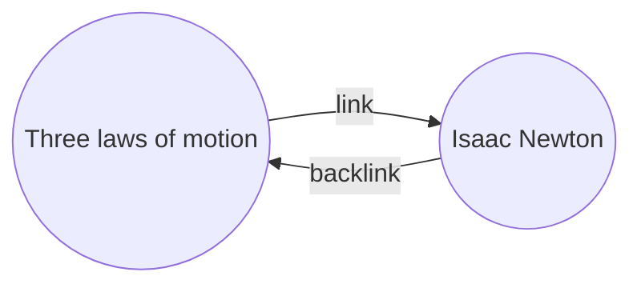

ด้วย[[ปลั๊กอินหลัก|ปลั๊กอิน]]แบ็คลิงค์ คุณสามารถดู_แบ็คลิงค์_ทั้งหมดสำหรับโน้ตที่ใช้งานอยู่ได้

แบ็คลิงค์ของโน้ตคือลิงก์จากโน้ตอื่นที่ชี้มายังโน้ตนั้น ในตัวอย่างต่อไปนี้ โน้ต "กฎการเคลื่อนที่สามข้อ" มีลิงก์ไปยังโน้ต "ไอแซก นิวตัน" แบ็คลิงค์ที่สอดคล้องกันจะลิงก์จาก "ไอแซก นิวตัน" กลับไปยัง "กฎการเคลื่อนที่สามข้อ"

แบ็คลิงค์มีประโยชน์ในการค้นหาโน้ตที่อ้างอิงถึงโน้ตที่คุณกำลังเขียน ลองจินตนาการว่าคุณสามารถแสดงรายการแบ็คลิงค์ของเว็บไซต์ใดก็ได้บนอินเทอร์เน็ต

## แสดงแบ็คลิงค์

ปลั๊กอินแบ็คลิงค์จะแสดงแบ็คลิงค์สำหรับแท็บที่ใช้งานอยู่ มีสองส่วนที่ยุบได้: **การอ้างอิงถึงผ่านลิงค์** และ **การอ้างอิงถึงโดยไม่ผ่านลิงค์**

- **การอ้างอิงถึงผ่านลิงค์** คือแบ็คลิงค์ไปยังโน้ตที่มี[[ลิงค์ภายใน]]ไปยังโน้ตที่ใช้งานอยู่
- **การอ้างอิงถึงโดยไม่ผ่านลิงค์** คือแบ็คลิงค์ไปยังการปรากฏของชื่อโน้ตที่ใช้งานอยู่ที่ไม่ได้ลิงก์ไว้

มีตัวเลือกปรับแต่งดังต่อไปนี้:

- **ยุบผลการค้นหา** สลับว่าจะขยายแต่ละโน้ตเพื่อแสดงการอ้างอิงในนั้นหรือไม่
- **แสดงผลข้อมูลบริบทเพิ่มเติม** สลับว่าจะตัดทอนหรือแสดงย่อหน้าเต็มที่มีการอ้างอิง
- **เปลี่ยนวิธีการเรียงลำดับ** กำหนดวิธีจัดเรียงการอ้างอิง
- **แสดงตัวกรองการค้นหา** สลับช่องข้อความที่ให้คุณกรองการอ้างอิง สำหรับข้อมูลเพิ่มเติมเกี่ยวกับการสร้างคำค้นหา โปรดดู [[ค้นหา]]

## ดูแบ็คลิงค์ของโน้ต

เพื่อดูแบ็คลิงค์ของโน้ตที่ใช้งานอยู่ ให้คลิกแท็บ **แบ็คลิงค์** ![[obsidian-icon-links-coming-in.svg#icon]] ในแถบด้านข้างขวา

> [!note] หมายเหตุ
> หากคุณไม่เห็นแท็บแบ็คลิงค์ คุณสามารถทำให้มันแสดงได้โดยเปิด [[กระดานคำสั่ง]] แล้วรันคำสั่ง **แบ็คลิงค์: แสดงแบ็คลิงค์**

> [!info] ไฟล์ที่ไม่รวม
> ไฟล์ที่ตรงกับรูปแบบ [[การตั้งค่า#ไฟล์ที่ไม่รวม|ไฟล์ที่ไม่รวม]] ของคุณจะไม่ปรากฏในการอ้างอิงถึงโดยไม่ผ่านลิงค์

## ดูแบ็คลิงค์ของโน้ตเฉพาะ

แท็บแบ็คลิงค์จะแสดงรายการแบ็คลิงค์สำหรับโน้ตที่ใช้งานอยู่ และอัปเดตเมื่อคุณสลับไปยังโน้ตอื่น หากคุณต้องการดูแบ็คลิงค์ของโน้ตเฉพาะ ไม่ว่าจะใช้งานอยู่หรือไม่ คุณสามารถเปิดแท็บแบ็คลิงค์แบบ _ลิงก์ไว้_ ได้

เพื่อเปิดแท็บแบ็คลิงค์แบบลิงก์ไว้:

1. เปิด [[กระดานคำสั่ง]]
2. เลือก **แบ็คลิงค์: เปิดดูแบ็คลิงค์ของไฟล์ปัจจุบัน**

แท็บแยกจะเปิดขึ้นข้างโน้ตที่ใช้งานอยู่ แท็บจะแสดงไอคอนลิงก์เพื่อให้คุณรู้ว่ามันลิงก์กับโน้ตอยู่

## แสดงแบ็คลิงค์ในโน้ต

แทนที่จะแสดงแบ็คลิงค์ในแท็บแยก คุณสามารถแสดงแบ็คลิงค์ที่ด้านล่างของโน้ตได้

เพื่อแสดงแบ็คลิงค์ในโน้ต:

1. เปิด [[กระดานคำสั่ง]]
2. เลือก **แบ็คลิงค์: เปิดปิดแบ็คลิงค์ในเอกสาร**

หรือ เปิดใช้งาน **แบ็คลิงค์ในเอกสาร** ภายใต้ตัวเลือกปรับแต่งปลั๊กอินแบ็คลิงค์ เพื่อเปิดปิดแบ็คลิงค์โดยอัตโนมัติเมื่อคุณเปิดโน้ตใหม่
