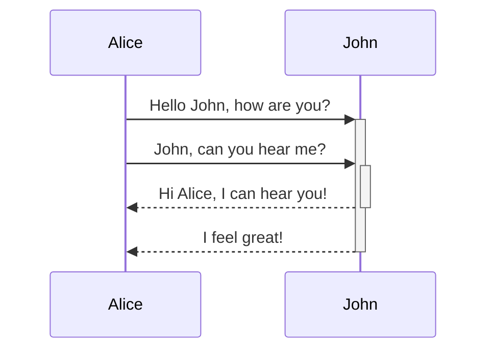
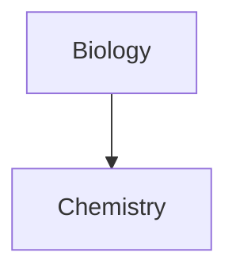

Notlarınıza gelişmiş biçimlendirme söz dizimi eklemeyi öğrenin.

## Tablolar

Sütunları ayırmak için dikey çizgiler (`|`) ve başlıkları tanımlamak için kısa çizgiler (`-`) kullanarak tablolar oluşturabilirsiniz. İşte bir örnek:

```md
| Ad    | Soyad  |
| ----- | ------ |
| Max   | Planck |
| Marie | Curie  |
```

| Ad    | Soyad  |
| ----- | ------ |
| Max   | Planck |
| Marie | Curie  |

Tablonun her iki tarafındaki dikey çizgiler isteğe bağlı olsa da, okunabilirlik açısından bunları eklemeniz önerilir.

> [!tip] *Canlı önizleme*'de bir tabloya sağ tıklayarak sütun ve satır ekleyebilir veya silebilirsiniz. Ayrıca bağlam menüsünü kullanarak bunları sıralayabilir ve taşıyabilirsiniz.

**Tablo ekle** komutunu [[Komut Paleti|Komut Paleti]]'nden veya sağ tıklayıp _Ekle → Tablo_ seçeneğini belirleyerek bir tablo ekleyebilirsiniz. Bu size temel, düzenlenebilir bir tablo verecektir:

```md
|     |     |
| --- | --- |
|     |     |
```

Hücrelerin mükemmel hizalanmasına gerek olmadığını, ancak başlık satırının en az iki kısa çizgi içermesi gerektiğini unutmayın:

```md
Ad | Soyad
-- | --
Max | Planck
Marie | Curie
```


### Tablo içindeki içeriği biçimlendirme

Tablo içindeki içeriği biçimlendirmek için [[Temel biçimlendirme söz dizimi|temel biçimlendirme söz dizimini]] kullanabilirsiniz.

| Birinci sütun                | İkinci sütun                                           |
| ---------------------------- | ------------------------------------------------------ |
| [[Dahili bağlantılar]]      | **Kasanızdaki** bir dosyaya _dahili_ bağlantı verir.   |
| [[Dosya gömme]]             | ![[Engelbart.jpg\|100]]                                |

> [!note] Tablolarda dikey çizgiler
> Tablonuzda [[Takma adlar|takma ad]] kullanmak veya [[Temel biçimlendirme söz dizimi#Harici görseller|bir görseli yeniden boyutlandırmak]] istiyorsanız, dikey çizgiden önce bir `\` eklemeniz gerekir.
>
> ```md
> Birinci sütun | İkinci sütun
> -- | --
> [[Temel biçimlendirme söz dizimi\|Markdown söz dizimi]] | ![[Engelbart.jpg\|200]]
> ```
>
> Birinci sütun | İkinci sütun
> -- | --
> [[Temel biçimlendirme söz dizimi\|Markdown söz dizimi]] | ![[Engelbart.jpg\|200]]

Başlık satırına iki nokta üst üste (`:`) ekleyerek sütunlardaki metni hizalayabilirsiniz. Ayrıca *canlı önizleme*'de bağlam menüsü aracılığıyla içeriği hizalayabilirsiniz.

```md
Sola hizalı metin | Ortaya hizalı metin | Sağa hizalı metin
:-- | :--: | --:
İçerik | İçerik | İçerik
```

Sola hizalı metin | Ortaya hizalı metin | Sağa hizalı metin
:-- | :--: | --:
İçerik | İçerik | İçerik

## Diyagram

[Mermaid](https://mermaid-js.github.io/) kullanarak notlarınıza diyagramlar ve grafikler ekleyebilirsiniz. Mermaid, [akış şemaları](https://mermaid.js.org/syntax/flowchart.html), [sıralama diyagramları](https://mermaid.js.org/syntax/sequenceDiagram.html) ve [zaman çizelgeleri](https://mermaid.js.org/syntax/timeline.html) gibi çeşitli diyagramları destekler.

> [!tip] İpucu
> Diyagramları notlarınıza eklemeden önce oluşturmanıza yardımcı olması için Mermaid'in [Canlı Düzenleyicisi](https://mermaid-js.github.io/mermaid-live-editor)'ni de deneyebilirsiniz.

Bir Mermaid diyagramı eklemek için bir `mermaid` [[Temel biçimlendirme söz dizimi#Kod blokları|kod bloğu]] oluşturun.

````md

````


````md

````


### Diyagramda dosyaları bağlama

Düğümlerinize `internal-link` [sınıfı](https://mermaid.js.org/syntax/flowchart.html#classes) ekleyerek diyagramlarınızda [[Dahili bağlantılar|dahili bağlantılar]] oluşturabilirsiniz.

````md

````


> [!note] Not
> Diyagramlardaki dahili bağlantılar [[Grafik Görünümü|Grafik Görünümü]]'nde görünmez.

Diyagramlarınızda çok sayıda düğüm varsa, aşağıdaki kod parçacığını kullanabilirsiniz.

````md

````

Bu şekilde, her harf düğümü, [düğüm metni](https://mermaid.js.org/syntax/flowchart.html#a-node-with-text) bağlantı metni olacak şekilde dahili bir bağlantı haline gelir.

> [!note] Not
> Not adlarınızda özel karakterler kullanıyorsanız, not adını çift tırnak içine almanız gerekir.
>
> ```
> class "⨳ special character" internal-link
> ```
>
> Veya, `A["⨳ special character"]`.

Diyagram oluşturma hakkında daha fazla bilgi için [resmi Mermaid belgelerine](https://mermaid.js.org/intro/) bakın.

## Matematik

[MathJax](http://docs.mathjax.org/en/latest/basic/mathjax.html) ve LaTeX gösterimini kullanarak notlarınıza matematiksel ifadeler ekleyebilirsiniz.

Notunuza bir MathJax ifadesi eklemek için, ifadeyi çift dolar işareti (`$$`) ile çevreleyin.

```md
$$
\begin{vmatrix}a & b\\
c & d
\end{vmatrix}=ad-bc
$$
```

$$
\begin{vmatrix}a & b\\
c & d
\end{vmatrix}=ad-bc
$$

Ayrıca `$` sembolleri ile çevreleyerek satır içi matematik ifadeleri de kullanabilirsiniz.

```md
Bu bir satır içi matematik ifadesidir $e^{2i\pi} = 1$.
```

Bu bir satır içi matematik ifadesidir $e^{2i\pi} = 1$.

Söz dizimi hakkında daha fazla bilgi için [MathJax temel eğitimi ve hızlı başvuru](https://math.meta.stackexchange.com/questions/5020/mathjax-basic-tutorial-and-quick-reference) sayfasına bakın.

Desteklenen MathJax paketlerinin listesi için [TeX/LaTeX Uzantı Listesi](http://docs.mathjax.org/en/latest/input/tex/extensions/index.html) sayfasına bakın.
