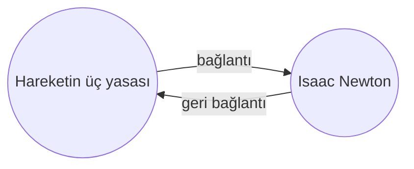

[[Yerleşik Eklentiler|Geri Bağlantılar eklentisi]] ile aktif not için tüm _geri bağlantıları_ görebilirsiniz.

Bir not için geri bağlantı, başka bir nottan o nota giden bir bağlantıdır. Aşağıdaki örnekte, "Hareketin üç yasası" notu "Isaac Newton" notuna bir bağlantı içermektedir. Karşılık gelen geri bağlantı ise "Isaac Newton"dan "Hareketin üç yasası"na geri bağlantı oluşturur.

Geri bağlantılar, yazdığınız nota referans veren notları bulmak için faydalı olabilir. İnternetteki herhangi bir web sitesi için geri bağlantıları listeleyebilseydiniz ne kadar yararlı olacağını bir düşünün.

## Geri bağlantıları göster

Geri Bağlantılar eklentisi, aktif sekmeler için geri bağlantıları görüntüler. İki daraltılabilir bölüm vardır: **Bağlantılı bahsetmeler** ve **Bağlantısız bahsetmeler**.

- **Bağlantılı bahsetmeler**, aktif nota bir dahili bağlantı içeren notlara ait geri bağlantılardır.
- **Bağlantısız bahsetmeler**, aktif notun adının bağlantısız herhangi bir geçişine ait geri bağlantılardır.

Aşağıdaki seçenekleri sunar:

- **Sonuçları gizle**, her notu genişleterek içindeki bahsetmeleri gösterip göstermemeyi değiştirir.
- **Daha fazla içerik göster**, bahsetmeyi içeren paragrafın kısaltılıp kısaltılmayacağını veya tam olarak gösterilip gösterilmeyeceğini değiştirir.
- **Sıralamayı değiştir**, bahsetmelerin nasıl sıralanacağını belirler.
- **Arama filtrelerini göster**, bahsetmeleri filtrelemenize olanak tanıyan bir metin alanını açıp kapatır. Arama terimi oluşturma hakkında daha fazla bilgi için [[Ara]] bölümüne bakın.

## Bir not için geri bağlantıları görüntüle

Aktif notun geri bağlantılarını görüntülemek için sağ kenar çubuğundaki **Geri Bağlantılar** ![[obsidian-icon-links-coming-in.svg#icon]] sekmesine tıklayın.

> [!note] Not
> Geri Bağlantılar sekmesini göremiyorsanız, [[Komut Paleti]]ni açıp **Geri Bağlantılar: Geri bağlantıları göster** komutunu çalıştırarak görünür hale getirebilirsiniz.

> [!info] Hariç tutulan dosyalar
> [[Ayarlar#Hariç tutulan dosyalar|Hariç tutulan dosyalar]] kalıplarınızla eşleşen dosyalar Bağlantısız bahsetmelerde görünmez.

## Belirli bir notun geri bağlantılarını görme

Geri bağlantılar sekmesi, aktif not için geri bağlantıları listeler ve farklı bir nota geçtiğinizde güncellenir. Aktif olup olmadığına bakılmaksızın belirli bir notun geri bağlantılarını görmek istiyorsanız, _bağlantılı_ bir geri bağlantılar sekmesi açabilirsiniz.

Bağlantılı bir geri bağlantılar sekmesi açmak için:

1. [[Komut Paleti]]ni açın.
2. **Geri Bağlantılar: Mevcut dosyanın geri bağlantılarını aç** seçeneğini seçin.

Aktif notunuzun yanında ayrı bir sekme açılır. Sekme, bir nota bağlı olduğunu bilmeniz için bir bağlantı simgesi gösterir.

## Bir notta geri bağlantıları göster

Geri bağlantıları ayrı bir sekmede göstermek yerine, notunuzun alt kısmında gösterebilirsiniz.

Bir notta geri bağlantıları göstermek için:

1. [[Komut Paleti]]ni açın.
2. **Geri Bağlantılar: Belgedeki geri bağlantıları aç/kapat** seçeneğini seçin.

Veya yeni bir not açtığınızda geri bağlantıları otomatik olarak açıp kapatmak için Geri Bağlantılar eklenti seçeneklerinde **Belgede geri bağlantı** seçeneğini etkinleştirin.
