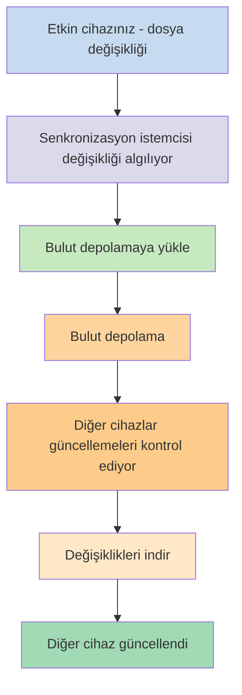
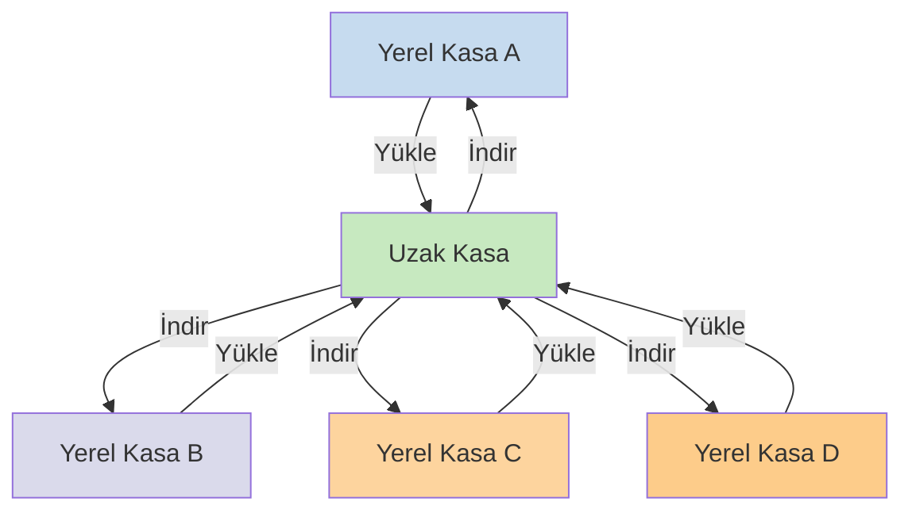

Notlarınızı farklı cihazlarda kullanmak istiyorsanız, sahip olduğunuz seçeneklerden biri [[Notlarınızı cihazlar arasında senkronize edin]] yöntemidir. Obsidian, [[Obsidian Sync'e giriş|Obsidian Sync]] adında, [[Notlarınızı cihazlar arasında senkronize edin#iCloud|iCloud]] ve [[Notlarınızı cihazlar arasında senkronize edin#OneDrive|OneDrive]] gibi diğer senkronizasyon hizmetlerinden farklı çalışan bir hizmet sunar.

İşte bazı temel terimler:

- **Kasa**, dosya sisteminizde notlar ve Obsidian'a özgü yapılandırma içeren bir `.obsidian` klasörü barındıran bir klasördür.
- **Yerel kasa**, kasanızın her bir cihazınızda bulunan kopyasıdır. Senkronizasyon hizmetlerini kullanırken, senkronizasyonu etkinleştirmek için bu yerel kasaları bağlarsınız.
- **Uzak kasa**, yerel kasaların Obsidian Sync aracılığıyla doğrudan bağlandığı merkezi depolama alanıdır.

Senkronizasyon için iki yaygın yaklaşım vardır:

- **[[#Dosya tabanlı senkronizasyon hizmetleri]]**: Yerel kasalar izlenen klasörlerde bulunmalıdır, senkronizasyon dosya sistemi üzerinden gerçekleşir
- **[[#Obsidian Sync|Uzak kasalar]]**: Yerel kasaların Obsidian aracılığıyla doğrudan bağlandığı merkezi depolama

## Dosya tabanlı senkronizasyon hizmetleri

Dropbox, Google Drive, iCloud ve OneDrive gibi hizmetler klasör tabanlıdır. Bu hizmetler belirli klasörleri izler ve içlerine yerleştirilen dosyaları otomatik olarak senkronize eder. Dosyaların senkronize olabilmesi için belirlenmiş bulut hizmeti klasörlerinde bulunması gerekir. Dosya tabanlı senkronizasyon hizmetlerinde, yerel kasanız izlenen başka bir klasör gibi davranır. Özel bir uzak kasa yoktur - bunun yerine bulut depolama bir geçiş noktası görevi görerek dosyaları farklı cihazlardaki yerel kasalar arasında kopyalar.

Aşağıdaki diyagram bu hizmetlerin nasıl çalıştığının basitleştirilmiş bir versiyonunu göstermektedir:

Bulut hizmetinin arka plan senkronizasyonu varsa, bu süreçlerin bazıları dosyaları görüntülemek için uygulamaları aktif olarak kullanmıyor olsanız bile gerçekleşebilir. Bu hizmetler belirli klasörleri izler ve içlerine yerleştirilen dosyaları otomatik olarak senkronize eder. Dosyaların senkronize olabilmesi için belirlenmiş bulut hizmeti klasörlerinde bulunması gerekir.

## Obsidian Sync

Obsidian Sync, [[Obsidian Sync'e giriş|Obsidian Sync]] hizmeti aracılığıyla merkezi depolama görevi gören bir uzak kasa oluşturmanıza olanak tanır. Bu sayede dosyalarınızı depolamak için herhangi bir cihazınızdaki neredeyse herhangi bir klasörü seçebilirsiniz - ister harici bir sabit diskde, ister `C:\` içinde, ister Android'de uygulama depolamasında olsun.

Ancak, aynı cihazda [[#Dosya tabanlı senkronizasyon hizmetleri]] de kullanıyorsanız, yerel kasanız için önerilen konumların bir listesi bulunmaktadır - özellikle [[Obsidian Sync'e geçiş#Kasanızı üçüncü taraf senkronizasyon hizmetinizden veya bulut depolamadan taşıyın|üçüncü taraf senkronizasyon hizmeti]] içinde olmayan herhangi bir yer.

Aşağıdaki diyagram Obsidian Sync'in nasıl çalıştığının basitleştirilmiş bir versiyonunu göstermektedir:

Bu sistemin gücü, daha fazla cihaz türüyle daha belirgin hale gelir. [[#Dosya tabanlı senkronizasyon hizmetleri]] işletim sistemleri arasında tutarsız bir şekilde uygulanabilir ve mobil cihazların uygulamaların nasıl izole edileceği ve güç kısıtlamasına tabi tutulacağı konusunda kendi kuralları vardır, bu da geleneksel dosya tabanlı hizmetlerin sorunsuz çalışmasını çok daha zorlaştırır.

Obsidian Sync ile hizmet, senkronizasyonu doğrudan uygulama üzerinden yönetir ve cihaz türünden veya işletim sistemi sınırlamalarından bağımsız olarak tutarlı bir davranış sağlarken, verilerinizin yerel bir kopyasını [[Obsidian dosyalarınızı yedekleyin|hafif yedek]] olarak korumaya öncelik verir.

### Senkronizasyon davranışı

Yerel kasanızdaki dosyalarda değişiklik yaptığınızda, Obsidian Sync bu değişiklikleri algılar ve uzak kasaya yükler. Aynı uzak kasaya bağlı diğer cihazlar bu değişiklikleri indirir ve yerel kasalarına uygular. Obsidian Sync, değişiklikleri dosya düzeyinde takip eder ve tüm klasörleri senkronize etmek yerine yalnızca değiştirilmiş dosyaları aktarır. Bu, bant genişliği kullanımını ve senkronizasyon süresini azaltır.

Çakışmalar oluştuğunda veya hangi dosyaların senkronize edileceğini kontrol etmeniz gerektiğinde, Obsidian Sync bu durumları ele almak için belirli mekanizmalar sağlar:

![[Obsidian Sync sorun giderme#Çakışma çözümleme|Çakışma çözümleme]]

![[Sync ayarları ve seçici senkronizasyon#Seçici senkronizasyon#Bir klasörü senkronizasyondan hariç tutma]]

### Çevrimdışı davranış

Çevrimdışıyken yapılan değişiklikler sıraya alınır ve cihazınız internete yeniden bağlandığında ve Obsidian açık olduğunda otomatik olarak senkronize edilir. Yerel kasanız çevrimdışı dönemlerde tamamen işlevsel kalır.

## Sonraki adımlar

- Uzak kasalarla başlamak için [[Obsidian Sync kurulumu]] sayfasına bakın.
- Şu anda dosya tabanlı senkronizasyon kullanıyorsanız ve Obsidian Sync kullanmak istiyorsanız [[Obsidian Sync'e geçiş]] sayfasına bakın.
- Hâlâ karar verme aşamasındaysanız [[Notlarınızı cihazlar arasında senkronize edin|diğer senkronizasyon seçeneklerini keşfedin]].
