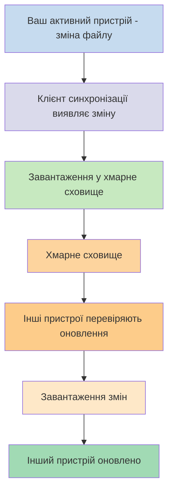
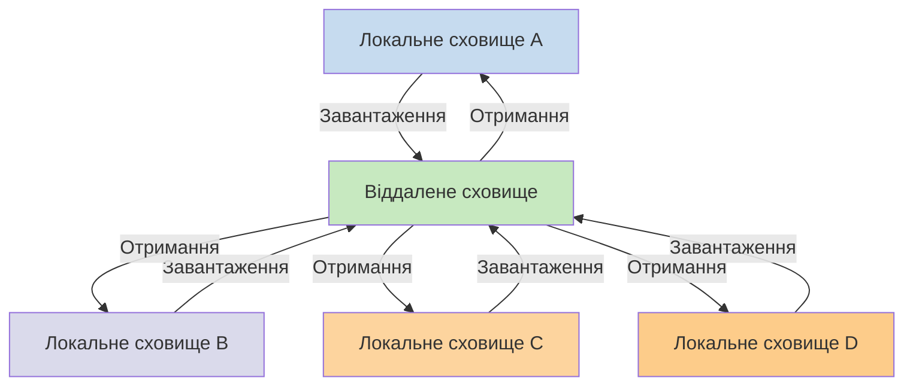

Якщо ви хочете використовувати свої нотатки на різних пристроях, одним із варіантів є [[Синхронізація нотаток між пристроями]]. Obsidian пропонує власний сервіс — [[Вступ до Obsidian Sync|Obsidian Sync]], — який працює інакше, ніж інші сервіси синхронізації, як-от [[Синхронізація нотаток між пристроями#iCloud|iCloud]] та [[Синхронізація нотаток між пристроями#OneDrive|OneDrive]].

Ось деякі ключові терміни:

- **Сховище** — це тека у вашій файловій системі, яка містить нотатки та теку `.obsidian` з конфігурацією, специфічною для Obsidian.
- **Локальне сховище** — це копія вашого сховища, що існує на кожному з ваших пристроїв. При використанні сервісів синхронізації ви зʼєднуєте ці локальні сховища для забезпечення синхронізації.
- **Віддалене сховище** — це централізоване сховище, до якого локальні сховища підʼєднуються безпосередньо через Obsidian Sync.

Існують два основні підходи до синхронізації:

- **[[#Файлові сервіси синхронізації]]**: Локальні сховища повинні перебувати у відстежуваних теках, синхронізація відбувається через файлову систему
- **[[#Obsidian Sync|Віддалені сховища]]**: Централізоване сховище, до якого локальні сховища підʼєднуються безпосередньо через Obsidian

## Файлові сервіси синхронізації

Такі сервіси, як Dropbox, Google Drive, iCloud та OneDrive, працюють на основі тек. Ці сервіси відстежують певні теки та автоматично синхронізують усі файли, розміщені в них. Файли повинні перебувати у визначених теках хмарного сервісу для синхронізації. З файловими сервісами синхронізації ваше локальне сховище є просто ще однією відстежуваною текою. Виділеного віддаленого сховища немає — натомість хмарне сховище слугує посередником, копіюючи файли між локальними сховищами на різних пристроях.

Діаграма нижче показує спрощену версію роботи цих сервісів:

Якщо хмарний сервіс має фонову синхронізацію, деякі з цих процесів можуть відбуватися навіть тоді, коли ви не використовуєте застосунки для перегляду файлів. Ці сервіси відстежують певні теки та автоматично синхронізують усі файли, розміщені в них. Файли повинні перебувати у визначених теках хмарного сервісу для синхронізації.

## Obsidian Sync

Obsidian Sync дозволяє створити віддалене сховище, яке слугує централізованим сховищем через сервіс [[Вступ до Obsidian Sync|Obsidian Sync]]. Це дає змогу обрати майже будь-яку теку на будь-якому з ваших пристроїв для зберігання файлів — чи то зовнішній жорсткий диск, `C:\`, чи сховище застосунку на Android.

Однак у нас є список рекомендованих розташувань для вашого локального сховища, якщо ви також використовуєте [[#Файлові сервіси синхронізації]] на тому ж пристрої — головним чином, будь-де, крім [[Перехід на Obsidian Sync#Перемістіть ваше сховище з стороннього сервісу синхронізації або хмарного сховища|стороннього сервісу синхронізації]].

Діаграма нижче показує спрощену версію роботи Obsidian Sync:

Перевага цієї системи стає більш очевидною з більшою кількістю типів пристроїв. [[#Файлові сервіси синхронізації]] можуть бути реалізовані непослідовно на різних операційних системах, а мобільні пристрої мають власні правила щодо ізоляції застосунків та обмеження енергоспоживання, що значно ускладнює безперебійну роботу традиційних файлових сервісів.

З Obsidian Sync сервіс здійснює синхронізацію безпосередньо через застосунок, забезпечуючи однакову поведінку незалежно від типу пристрою чи обмежень операційної системи, водночас надаючи пріоритет збереженню локальної копії ваших даних як [[Резервне копіювання файлів Obsidian|м'якої резервної копії]].

### Поведінка синхронізації

Коли ви вносите зміни до файлів у локальному сховищі, Obsidian Sync виявляє ці зміни та завантажує їх до віддаленого сховища. Інші пристрої, підʼєднані до того ж віддаленого сховища, потім отримують ці зміни та застосовують їх до своїх локальних сховищ. Obsidian Sync відстежує зміни на рівні файлів і передає лише змінені файли, а не синхронізує цілі теки. Це зменшує використання трафіку та час синхронізації.

Коли виникають конфлікти або коли потрібно контролювати, які файли синхронізуються, Obsidian Sync надає спеціальні механізми для обробки цих ситуацій:

![[Вирішення проблем Obsidian Sync#Розв'язання конфліктів|Розв'язання конфліктів]]

![[Налаштування Sync та вибіркова синхронізація#Вибіркова синхронізація#Виключити теку із синхронізації]]

### Поведінка в автономному режимі

Зміни, зроблені в автономному режимі, ставляться в чергу та автоматично синхронізуються, коли ваш пристрій повторно підʼєднується до інтернету і Obsidian відкрито. Ваше локальне сховище залишається повністю функціональним протягом автономних періодів.

## Наступні кроки

- [[Налаштування Obsidian Sync]], щоб почати роботу з віддаленими сховищами.
- [[Перехід на Obsidian Sync]], якщо ви зараз використовуєте файлову синхронізацію та хочете перейти на Obsidian Sync.
- [[Синхронізація нотаток між пристроями|Ознайомтеся з іншими варіантами синхронізації]], якщо ви ще вирішуєте.
