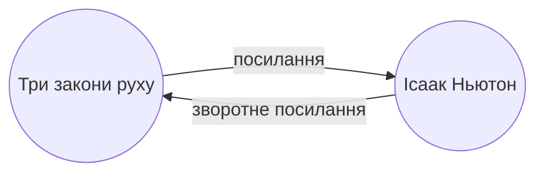

Завдяки [[Вбудовані додатки|додатку]] Зворотні посилання ви можете переглядати всі _зворотні посилання_ для активної нотатки.

Зворотне посилання для нотатки — це посилання з іншої нотатки на цю нотатку. У наступному прикладі нотатка "Три закони руху" містить посилання на нотатку "Ісаак Ньютон". Відповідне зворотне посилання буде вести від "Ісаака Ньютона" назад до "Трьох законів руху".

Зворотні посилання можуть бути корисними для пошуку нотаток, що посилаються на нотатку, яку ви пишете. Тільки уявіть, якби ви могли переглянути зворотні посилання для будь-якого вебсайту в інтернеті.

## Показ зворотних посилань

Додаток Зворотні посилання відображає зворотні посилання для активних вкладок. Є два розгортувані розділи: **Згадки з посиланням** та **Непов'язані згадки**.

- **Згадки з посиланням** — це зворотні посилання на нотатки, що містять внутрішнє посилання на активну нотатку.
- **Непов'язані згадки** — це зворотні посилання на будь-яке згадування назви активної нотатки без посилання.

Додаток надає такі опції:

- **Згорнути результати** перемикає, чи розгортати кожну нотатку для відображення згадок у ній.
- **Розгорнути контекст** перемикає, чи скорочувати або відображати повний абзац, що містить згадку.
- **Спосіб сортування** визначає, як сортувати згадки.
- **Показати пошуковий запит** перемикає текстове поле, яке дозволяє фільтрувати згадки. Для додаткової інформації про створення пошукового запиту зверніться до [[Пошук]].

## Перегляд зворотних посилань для нотатки

Щоб переглянути зворотні посилання для активної нотатки, натисніть вкладку **Зворотні посилання** ![[obsidian-icon-links-coming-in.svg#icon]] на правій бічній панелі.

> [!note] Примітка
> Якщо ви не бачите вкладку Зворотні посилання, ви можете зробити її видимою, відкривши [[Меню команд]] та виконавши команду **Зворотні посилання: Показ зворотних посилань**.

> [!info] Виключені файли
> Файли, що відповідають вашим шаблонам [[Налаштування#Виключені файли|Виключені файли]], не відображатимуться в Непов'язаних згадках.

## Перегляд зворотних посилань конкретної нотатки

Вкладка зворотних посилань показує зворотні посилання для активної нотатки та оновлюється, коли ви перемикаєтесь на іншу нотатку. Якщо ви хочете бачити зворотні посилання для конкретної нотатки, незалежно від того, чи є вона активною, ви можете відкрити _прив'язану_ вкладку зворотних посилань.

Щоб відкрити прив'язану вкладку зворотних посилань:

1. Відкрийте [[Меню команд]].
2. Виберіть **Зворотні посилання: Показати зворотні посилання для поточного файлу**.

Окрема вкладка відкриється поруч із вашою активною нотаткою. На вкладці відображається значок посилання, щоб ви знали, що вона прив'язана до нотатки.

## Показ зворотних посилань у нотатці

Замість відображення зворотних посилань в окремій вкладці ви можете показувати зворотні посилання внизу вашої нотатки.

Щоб показати зворотні посилання в нотатці:

1. Відкрийте [[Меню команд]].
2. Виберіть **Зворотні посилання: Змінити показ зворотних посилань в документі**.

Або увімкніть **Зворотні посилання в документі** в налаштуваннях додатка Зворотні посилання, щоб автоматично вмикати зворотні посилання при відкритті нової нотатки.
