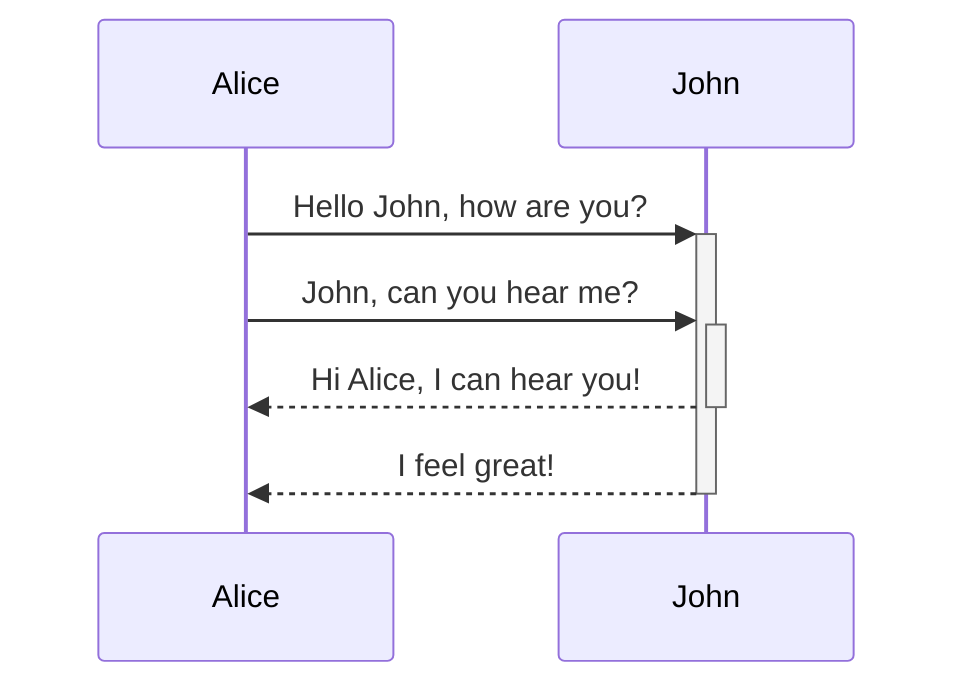
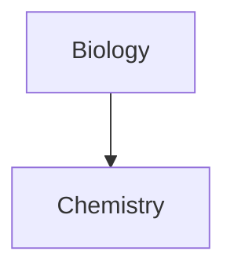

Дізнайтеся, як додавати розширений синтаксис форматування до ваших нотаток.

## Таблиці

Ви можете створювати таблиці, використовуючи вертикальні риски (`|`) для розділення стовпців і дефіси (`-`) для визначення заголовків. Ось приклад:

```md
| First name | Last name |
| ---------- | --------- |
| Max        | Planck    |
| Marie      | Curie     |
```

| First name | Last name |
| ---------- | --------- |
| Max        | Planck    |
| Marie      | Curie     |

Хоча вертикальні риски з обох боків таблиці є необов'язковими, рекомендується додавати їх для кращої читабельності.

> [!tip] У режимі _динамічного відображення_ ви можете клацнути правою кнопкою миші на таблицю, щоб додати або видалити стовпці та рядки. Ви також можете сортувати та переміщувати їх за допомогою контекстного меню.

Ви можете вставити таблицю за допомогою команди **Вставити таблицю** з [[Меню команд|Меню команд]] або клацнувши правою кнопкою миші та вибравши _Додати → Таблиця_. Це створить базову редаговану таблицю:

```md
|     |     |
| --- | --- |
|     |     |
```

Зверніть увагу, що комірки не потребують ідеального вирівнювання, але рядок заголовка має містити принаймні два дефіси:

```md
First name | Last name
-- | --
Max | Planck
Marie | Curie
```


### Форматування вмісту в таблиці

Ви можете використовувати [[Базовий синтаксис форматування|базовий синтаксис форматування]] для стилізації вмісту в таблиці.

| First column       | Second column                           |
| ------------------ | --------------------------------------- |
| [[Внутрішні посилання]] | Посилання на файл _усередині_ вашого **сховища**. |
| [[Вбудовування файлів]]    | ![[Engelbart.jpg\|100]]                 |

> [!note] Вертикальні риски в таблицях
> Якщо ви хочете використовувати [[Псевдоніми|псевдоніми]] або [[Базовий синтаксис форматування#Зовнішні зображення|змінити розмір зображення]] у таблиці, вам потрібно додати `\` перед вертикальною рискою.
>
> ```md
> First column | Second column
> -- | --
> [[Базовий синтаксис форматування\|Синтаксис Markdown]] | ![[Engelbart.jpg\|200]]
> ```
>
> First column | Second column
> -- | --
> [[Базовий синтаксис форматування\|Синтаксис Markdown]] | ![[Engelbart.jpg\|200]]

Вирівнюйте текст у стовпцях, додаючи двокрапки (`:`) до рядка заголовка. Ви також можете вирівняти вміст у режимі _динамічного відображення_ через контекстне меню.

```md
Left-aligned text | Center-aligned text | Right-aligned text
:-- | :--: | --:
Content | Content | Content
```

Left-aligned text | Center-aligned text | Right-aligned text
:-- | :--: | --:
Content | Content | Content

## Діаграми

Ви можете додавати діаграми та графіки до своїх нотаток за допомогою [Mermaid](https://mermaid-js.github.io/). Mermaid підтримує різні типи діаграм, такі як [блок-схеми](https://mermaid.js.org/syntax/flowchart.html), [діаграми послідовності](https://mermaid.js.org/syntax/sequenceDiagram.html) та [часові шкали](https://mermaid.js.org/syntax/timeline.html).

> [!tip] Підказка
> Ви також можете спробувати [Live Editor](https://mermaid-js.github.io/mermaid-live-editor) від Mermaid, щоб створювати діаграми перед додаванням їх до нотаток.

Щоб додати діаграму Mermaid, створіть [[Базовий синтаксис форматування#Блоки коду|блок коду]] `mermaid`.

````md

````


````md

````


### Посилання на файли в діаграмі

Ви можете створювати [[Внутрішні посилання|внутрішні посилання]] у діаграмах, додаючи [клас](https://mermaid.js.org/syntax/flowchart.html#classes) `internal-link` до вузлів.

````md

````


> [!note] Примітка
> Внутрішні посилання з діаграм не відображаються у [[Граф|Графі]].

Якщо у вашій діаграмі багато вузлів, ви можете використати наступний сніпет.

````md

````

Таким чином кожен буквений вузол стає внутрішнім посиланням, де [текст вузла](https://mermaid.js.org/syntax/flowchart.html#a-node-with-text) використовується як текст посилання.

> [!note] Примітка
> Якщо ви використовуєте спеціальні символи в назвах нотаток, вам потрібно взяти назву нотатки в подвійні лапки.
>
> ```
> class "⨳ special character" internal-link
> ```
>
> Або `A["⨳ special character"]`.

Для отримання додаткової інформації про створення діаграм зверніться до [офіційної документації Mermaid](https://mermaid.js.org/intro/).

## Математика

Ви можете додавати математичні вирази до нотаток за допомогою [MathJax](http://docs.mathjax.org/en/latest/basic/mathjax.html) та нотації LaTeX.

Щоб додати вираз MathJax до нотатки, оточіть його подвійними знаками долара (`$$`).

```md
$$
\begin{vmatrix}a & b\\
c & d
\end{vmatrix}=ad-bc
$$
```

$$
\begin{vmatrix}a & b\\
c & d
\end{vmatrix}=ad-bc
$$

Ви також можете вбудовувати математичні вирази в рядок, обгорнувши їх символами `$`.

```md
This is an inline math expression $e^{2i\pi} = 1$.
```

This is an inline math expression $e^{2i\pi} = 1$.

Для отримання додаткової інформації про синтаксис зверніться до [базового посібника та короткого довідника MathJax](https://math.meta.stackexchange.com/questions/5020/mathjax-basic-tutorial-and-quick-reference).

Для переліку підтримуваних пакетів MathJax зверніться до [списку розширень TeX/LaTeX](http://docs.mathjax.org/en/latest/input/tex/extensions/index.html).
