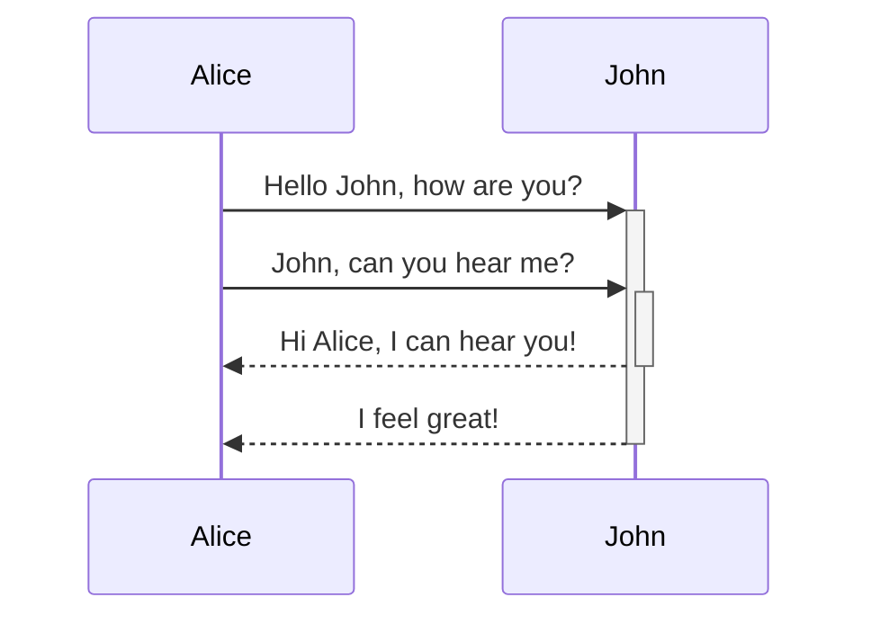
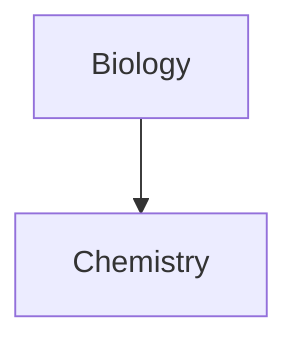

Tìm hiểu cách thêm cú pháp định dạng nâng cao vào ghi chú của bạn.

## Bảng

Bạn có thể tạo bảng bằng cách sử dụng dấu gạch đứng (`|`) để phân tách các cột và dấu gạch nối (`-`) để xác định tiêu đề. Đây là một ví dụ:

```md
| Tên | Họ |
| ---------- | --------- |
| Max        | Planck    |
| Marie      | Curie     |
```

| Tên | Họ |
| ---------- | --------- |
| Max        | Planck    |
| Marie      | Curie     |

Mặc dù các dấu gạch đứng ở hai bên bảng là tùy chọn, nhưng nên sử dụng chúng để dễ đọc hơn.

> [!tip] Trong _Xem trước trực tiếp_, bạn có thể nhấp chuột phải vào bảng để thêm hoặc xóa cột và hàng. Bạn cũng có thể sắp xếp và di chuyển chúng bằng menu ngữ cảnh.

Bạn có thể chèn bảng bằng lệnh **Chèn bảng** từ [[Khay lệnh|Bảng lệnh]] hoặc bằng cách nhấp chuột phải và chọn _Chèn → Bảng_. Thao tác này sẽ cung cấp cho bạn một bảng cơ bản có thể chỉnh sửa:

```md
|     |     |
| --- | --- |
|     |     |
```

Lưu ý rằng các ô không cần căn chỉnh hoàn hảo, nhưng hàng tiêu đề phải chứa ít nhất hai dấu gạch nối:

```md
Tên | Họ
-- | --
Max | Planck
Marie | Curie
```


### Định dạng nội dung bên trong bảng

Bạn có thể sử dụng [[Cú pháp định dạng cơ bản]] để tạo kiểu cho nội dung bên trong bảng.

| Cột đầu tiên       | Cột thứ hai                           |
| ------------------ | --------------------------------------- |
| [[Liên kết nội bộ]] | Liên kết đến một tệp _bên trong_ **kho** của bạn. |
| [[Nhúng tệp]]    | ![[Engelbart.jpg\|100]]                 |

> [!note] Dấu gạch đứng trong bảng
> Nếu bạn muốn sử dụng [[Bí danh|bí danh]], hoặc [[Cú pháp định dạng cơ bản#Hình ảnh bên ngoài|thay đổi kích thước hình ảnh]] trong bảng, bạn cần thêm `\` trước dấu gạch đứng.
>
> ```md
> Cột đầu tiên | Cột thứ hai
> -- | --
> [[Cú pháp định dạng cơ bản\|Cú pháp Markdown]] | ![[Engelbart.jpg\|200]]
> ```
>
> Cột đầu tiên | Cột thứ hai
> -- | --
> [[Cú pháp định dạng cơ bản\|Cú pháp Markdown]] | ![[Engelbart.jpg\|200]]

Căn chỉnh văn bản trong cột bằng cách thêm dấu hai chấm (`:`) vào hàng tiêu đề. Bạn cũng có thể căn chỉnh nội dung trong _Xem trước trực tiếp_ qua menu ngữ cảnh.

```md
Left-aligned text | Center-aligned text | Right-aligned text
:-- | :--: | --:
Content | Content | Content
```

Left-aligned text | Center-aligned text | Right-aligned text
:-- | :--: | --:
Content | Content | Content

## Sơ đồ

Bạn có thể thêm sơ đồ và biểu đồ vào ghi chú của mình bằng cách sử dụng [Mermaid](https://mermaid-js.github.io/). Mermaid hỗ trợ nhiều loại sơ đồ, chẳng hạn như [lưu đồ](https://mermaid.js.org/syntax/flowchart.html), [sơ đồ tuần tự](https://mermaid.js.org/syntax/sequenceDiagram.html) và [dòng thời gian](https://mermaid.js.org/syntax/timeline.html).

> [!tip] Mẹo
> Bạn cũng có thể thử [Trình soạn thảo trực tiếp](https://mermaid-js.github.io/mermaid-live-editor) của Mermaid để giúp bạn xây dựng sơ đồ trước khi đưa chúng vào ghi chú.

Để thêm sơ đồ Mermaid, hãy tạo một [[Cú pháp định dạng cơ bản#Khối mã|khối mã]] `mermaid`.

````md

````


````md

````


### Liên kết tệp trong sơ đồ

Bạn có thể tạo [[Liên kết nội bộ|liên kết nội bộ]] trong sơ đồ bằng cách gắn [lớp](https://mermaid.js.org/syntax/flowchart.html#classes) `internal-link` vào các nút của bạn.

````md

````


> [!note] Lưu ý
> Liên kết nội bộ từ sơ đồ không hiển thị trong [[Xem biểu đồ|chế độ xem đồ thị]].

Nếu bạn có nhiều nút trong sơ đồ, bạn có thể sử dụng đoạn mã sau.

````md

````

Bằng cách này, mỗi nút chữ cái sẽ trở thành một liên kết nội bộ, với [văn bản nút](https://mermaid.js.org/syntax/flowchart.html#a-node-with-text) làm văn bản liên kết.

> [!note] Lưu ý
> Nếu bạn sử dụng ký tự đặc biệt trong tên ghi chú, bạn cần đặt tên ghi chú trong dấu ngoặc kép.
>
> ```
> class "⨳ special character" internal-link
> ```
>
> Hoặc, `A["⨳ special character"]`.

Để biết thêm thông tin về cách tạo sơ đồ, hãy tham khảo [tài liệu chính thức của Mermaid](https://mermaid.js.org/intro/).

## Toán học

Bạn có thể thêm biểu thức toán học vào ghi chú của mình bằng cách sử dụng [MathJax](http://docs.mathjax.org/en/latest/basic/mathjax.html) và ký hiệu LaTeX.

Để thêm biểu thức MathJax vào ghi chú, hãy bao quanh nó bằng hai dấu đô la (`$$`).

```md
$$
\begin{vmatrix}a & b\\
c & d
\end{vmatrix}=ad-bc
$$
```

$$
\begin{vmatrix}a & b\\
c & d
\end{vmatrix}=ad-bc
$$

Bạn cũng có thể viết biểu thức toán học nội tuyến bằng cách bao quanh nó bằng ký hiệu `$`.

```md
This is an inline math expression $e^{2i\pi} = 1$.
```

This is an inline math expression $e^{2i\pi} = 1$.

Để biết thêm thông tin về cú pháp, hãy tham khảo [Hướng dẫn cơ bản và tham chiếu nhanh MathJax](https://math.meta.stackexchange.com/questions/5020/mathjax-basic-tutorial-and-quick-reference).

Để xem danh sách các gói MathJax được hỗ trợ, hãy tham khảo [Danh sách tiện ích mở rộng TeX/LaTeX](http://docs.mathjax.org/en/latest/input/tex/extensions/index.html).
