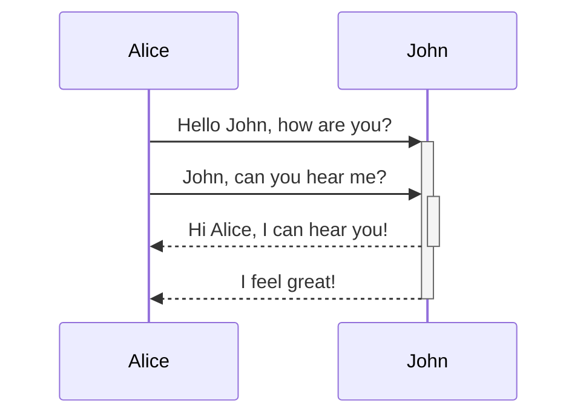

Obsidian là một ứng dụng ghi chú dựa trên Markdown và là một ứng dụng dựa trên kiến ​​thức.

Hiện tại, các định dạng sau được hỗ trợ.

---

### Liên kết nội bộ

```md
Liên kết đến một trang: [[Internal link]].
```

Liên kết đến một trang: [[Internal link]].

---

### Nhúng

Nhúng file khác (đọc thêm về [[Nhúng file]]). Đây là một phần được nhúng:

```md
![[Obsidian#What is Obsidian]]
```

![[Obsidian#What is Obsidian]]

---

### Tiêu đề

```md
# This is a heading 1
## This is a heading 2
### This is a heading 3 
#### This is a heading 4
##### This is a heading 5
###### This is a heading 6
```

# This is a heading 1
## This is a heading 2
### This is a heading 3 
#### This is a heading 4
##### This is a heading 5
###### This is a heading 6

---

### Nhấn mạnh

```md
*Văn bản này sẽ được in nghiêng*
_Điều này cũng sẽ được in nghiêng_
```

*Văn bản này sẽ được in nghiêng*
_Điều này cũng sẽ được in nghiêng_

```md
**Văn bản này sẽ được in đậm**
__Điều này cũng sẽ được in đậm__
```

**Văn bản này sẽ được in đậm**
__Điều này cũng sẽ được in đậm__

```md
_Bạn **có thể** kết hợp chúng_
```

_Bạn **có thể** kết hợp chúng_

---

### Danh sách

```md
- Item 1
- Item 2
  - Item 2a
  - Item 2b

1. Item 1
1. Item 2
1. Item 3
   1. Item 3a
   1. Item 3b
```

- Item 1
- Item 2
  - Item 2a
  - Item 2b

1. Item 1
1. Item 2
1. Item 3
   1. Item 3a
   1. Item 3b

--- 

### Hình ảnh

```md

```


#### Thay đổi kích thước hình ảnh

Ví dụ về hình ảnh ở trên này đã được đổi kích thước thành chiều rộng 100 pixel:

```md

```


---

### Liên kết

#### Liên kết ngoại

Các liên kết kiểu Markdown có thể được sử dụng để tham chiếu đến các đối tượng bên ngoài, chẳng hạn như các trang web hoặc một trang hoặc hình ảnh bên trong.

```md
http://obsidian.md - automatic!
[Obsidian](http://obsidian.md)
```

http://obsidian.md - automatic!
[Obsidian](http://obsidian.md)

#### Liên kết URI Obsidian

Các liên kết [[sử dụng obsidian URI|Obsidian URI]] có thể được sử dụng để mở ghi chú trong Obsidian từ một vault Obsidian khác hoặc một chương trình khác.

Ví dụ: bạn có thể liên kết đến một file trong vault như vậy (vui lòng lưu ý [[Sử dụng obsidian URI#Encoding|encoding bắt buộc]]):

```md
[Liên kết đến ghi chú](obsidian://open?path=D:%2Fpath%2Fto%2Ffile.md)
```

[Liên kết đến ghi chú](obsidian://open?path=D:%2Fpath%2Fto%2Ffile.md)

Bạn có thể liên kết đến một ghi chú bằng tên vault và tên file của nó thay vì đường dẫn:

```md
[Liên kết đến ghi chú](obsidian://open?vault=MainVault&file=MyNote.md)
```

[Liên kết đến ghi chú](obsidian://open?vault=MainVault&file=MyNote.md)

#### Escaping

Nếu có khoảng trắng trong url, chúng có thể được xóa bằng cách sử dụng `%20` làm khoảng trắng, chẳng hạn như:

```md
[Tùy chọn xuất](Pasted%20image)
```

[Tùy chọn xuất](Pasted%20image)

Hoặc bạn có thể đặt target trong `<>`, chẳng hạn như:

```md
[Slides Demo](<Slides Demo>)
```

[Slides Demo](<Slides Demo>)

---

### Dấu ngoặc kép

```md
> Human beings face ever more complex and urgent problems, and their effectiveness in dealing with these problems is a matter that is critical to the stability and continued progress of society.

\- Doug Engelbart, 1961
```

> Human beings face ever more complex and urgent problems, and their effectiveness in dealing with these problems is a matter that is critical to the stability and continued progress of society.

\- Doug Engelbart, 1961

---

### Code inline

```md
Văn bản bên trong `backticks` trên một dòng sẽ được định dạng giống như code.
```

Văn bản bên trong `backticks` trên một dòng sẽ được định dạng giống như code. 


---

### Khối code

Đánh dấu cú pháp được hỗ trợ với ngôn ngữ được chỉ định sau bộ dấu backticks đầu tiên. Chúng tôi sử dụng prismjs để làm nổi bật cú pháp, bạn có thể tìm thấy danh sách các ngôn ngữ được hỗ trợ [tại trang web của họ](https://prismjs.com/#supported-languages)

<pre><code>```js
function fancyAlert(arg) {
  if(arg) {
    $.facebox({div:'#foo'})
  }
}
```</code></pre>

```js
function fancyAlert(arg) {
  if(arg) {
    $.facebox({div:'#foo'})
  }
}
```
    
	
```md
    Văn bản thụt lề với một tab được định dạng như thế này và cũng sẽ trông giống như một khối code trong bản xem trước.
```

    Văn bản thụt lề với một tab được định dạng như thế này và cũng sẽ trông giống như một khối code trong bản xem trước.
    
---

### Danh sách công việc

```md
- [x] #tags, [links](), **định dạng** được hỗ trợ
- [x] cú pháp danh sách bắt buộc (hỗ trợ bất kỳ danh sách không có thứ tự hoặc có thứ tự)
- [x] đây là một mục hoàn thành
- [?] đây cũng là một mục hoàn thành (hoạt động với mọi nhân vật)
- [ ] đây là một mục chưa hoàn thành
- [ ] công việc có thể được nhấp trong Xem trước để được đánh dấu
```

- [x] #tags, [links](), **định dạng** được hỗ trợ
- [x] cú pháp danh sách bắt buộc (hỗ trợ bất kỳ danh sách không có thứ tự hoặc có thứ tự)
- [x] đây là một mục hoàn thành
- [?] đây cũng là một mục hoàn thành (hoạt động với mọi nhân vật)
- [ ] đây là một mục chưa hoàn thành
- [ ] công việc có thể được nhấp trong Xem trước để được đánh dấu

---

### Bảng

Bạn có thể tạo bảng bằng cách tập hợp một danh sách các từ và chia chúng bằng dấu gạch nối `-` (đối với hàng đầu tiên), sau đó phân tách từng cột bằng dấu gạch đứng `|`:

```md
Tiêu đề đầu tiên | Tiêu đề thứ hai
------------ | ------------
Nội dung ô 1 | Nội dung ô 2
Nội dung cột 1 | Nội dung cột 2
```

Tiêu đề đầu tiên | Tiêu đề thứ hai
------------ | ------------
Nội dung ô 1 | Nội dung ô 2
Nội dung cột 1 | Nội dung cột 2

---

```md
Bảng có thể được điều chỉnh bằng dấu hai chấm | Một ví dụ khác với tiêu đề dài
:----------------|-------------:
nhờ `:` | cuối dòng được căn chỉnh

Nếu bạn đặt các liên kết trong bảng, chúng sẽ hoạt động, nhưng nếu bạn sử dụng Liên kết có đường ống, đường ống phải được thoát bằng dấu `\` để ngăn nó được đọc như một phần tử bảng.
```

Bảng có thể được điều chỉnh bằng dấu hai chấm | Một ví dụ khác với tiêu đề dài
:----------------|-------------:
nhờ `:` | cuối dòng được căn chỉnh

Nếu bạn đặt các liên kết trong bảng, chúng sẽ hoạt động, nhưng nếu bạn sử dụng Liên kết có đường ống, đường ống phải được thoát bằng dấu `\` để ngăn nó được đọc như một phần tử bảng.

```md
Tiêu đề đầu tiên | Tiêu đề thứ hai
------------ | ------------
[[Định dạng ghi chú của bạn\|Định dạng]]	|  [[Phím tắt\|hotkey]]
```

Tiêu đề đầu tiên | Tiêu đề thứ hai
------------ | ------------
[[Định dạng ghi chú của bạn\|Định dạng]]	|  [[Phím tắt\|hotkey]]	

---

### Dấu gạch ngang

```md
Bất kỳ từ nào được bao bọc bởi hai dấu ngã (như ~~này~~) sẽ bị gạch bỏ.
```

Bất kỳ từ nào được bao bọc bởi hai dấu ngã (như ~~này~~) sẽ bị gạch bỏ.

---

### Đánh dấu

```md
Sử dụng hai dấu bằng để ==đánh dấu văn bản==.
```

Sử dụng hai dấu bằng để ==đánh dấu văn bản==.

---

### Chú thích cuối trang

```md
Đây là một chú thích đơn giản,[^1] Đây là một chú thích đơn giản.[^bignote]

[^1]: meaningful!

[^bignote]: Đây là một trang có nhiều đoạn văn và code.

    Thụt lề các đoạn văn để đưa chúng vào chú thích cuối trang.

    `{ my code }`

    Thêm bao nhiêu đoạn tùy thích.
```

Đây là một chú thích đơn giản,[^1] và đây là một chú thích dài hơn.[^bignote]

[^1]: meaningful!

[^bignote]: Đây là một trang có nhiều đoạn văn và code.

    Thụt lề các đoạn văn để đưa chúng vào chú thích cuối trang.

    `{ my code }`

    Thêm bao nhiêu đoạn tùy thích.
	
```md
Bạn cũng có thể sử dụng chú thích một dòng. ^[lưu ý rằng dấu mũ nằm ngoài dấu ngoặc này.]
```

Bạn cũng có thể sử dụng chú thích một dòng. ^[lưu ý rằng dấu mũ nằm ngoài dấu ngoặc này.]

### Toán học

```md
$$\begin{vmatrix}a & b\\
c & d
\end{vmatrix}=ad-bc$$
```

$$\begin{vmatrix}a & b\\
c & d
\end{vmatrix}=ad-bc$$

Bạn cũng có thể thực hiện phép toán như $e^{2i\pi} = 1$ .

Obsidian sử dụng [Mathjax](http://docs.mathjax.org/en/latest/basic/mathjax.html). Bạn có thể kiểm tra gói nào được hỗ trợ trong Mathjax [tại đây](http://docs.mathjax.org/en/latest/input/tex/extensions/index.html).

### Comment

Sử dụng `%%` để bao bọc các comment, nó sẽ được phân tích cú pháp dưới dạng Markdown, nhưng sẽ không hiển thị trong bản xem trước.

```md
Đây là một comment trong một dòng: %%Bạn không thể nhìn thấy văn bản này%% (Không thể nhìn thấy nó)

Đây là một khối comment:
%%
Nó có thể kéo dài
nhiều dòng
%%
```

Đây là một comment trong một dòng: %%Bạn không thể nhìn thấy văn bản này%% (Không thể nhìn thấy nó)

Đây là một khối comment:
%%
Nó có thể kéo dài
nhiều dòng
%%

### Biểu đồ

Obsidian sử dụng [Mermaid](https://mermaid-js.github.io/) để hiển thị sơ đồ và biểu đồ. Mermaid cũng cung cấp [một trình biên tập trực tiếp hữu ích](https://mermaid-js.github.io/mermaid-live-editor).

<pre><code>```mermaid
sequenceDiagram
    Alice->>+John: Hello John, how are you?
    Alice->>+John: John, can you hear me?
    John-->>-Alice: Hi Alice, I can hear you!
    John-->>-Alice: I feel great!
```</code></pre>



Obsidian hỗ trợ liên kết đến các ghi chú trong Mermaid:
<pre><code>```mermaid
graph TD

Biology --> Chemistry

class Biology,Chemistry internal-link;
```</code></pre>

Một cách dễ dàng hơn để làm điều đó như sau: ^376b9d
<pre><code>```mermaid
graph TD

A[Biology]
B[Chemistry]

A --> B

class A,B,C,D,E,F,G,H,I,J,K,L,M,N,O,P,Q,R,S,T,U,V,W,X,Y,Z internal-link;
```</code></pre>

Bằng cách này, tất cả các tên ghi chú (ít nhất cho đến `Z[tên note]`) đều được tự động gán cho class `internal-link` khi bạn sử dụng đoạn code này.

Nếu bạn sử dụng các ký tự đặc biệt trong tên ghi chú của mình, bạn cần đặt tên ghi chú trong dấu ngoặc kép.
`"⨳ ký tự đặc biệt"`
Nó trông giống như thế này nếu bạn làm theo [[Định dạng ghi chú của bạn#^376b9d|lựa chọn thứ hai]]:
`A["⨳ ký tự đặc biệt"]`

## Ghi chú của nhà lập trình

Chúng tôi cố gắng đạt được khả năng tối đa mà không phá vỡ bất kỳ định dạng hiện có nào, do đó chúng tôi sử dụng sự kết hợp hơi không chính thống giữa các markdown. Nói chung, nó là CommonMark, với việc bổ sung một số chức năng từ GitHub Flavored Markdown (GFM), một số hỗ trợ latex và cú pháp nhúng chúng tôi lựa chọn, bạn có thể đọc thêm tại [[Định dạng file được chấp nhận]].
