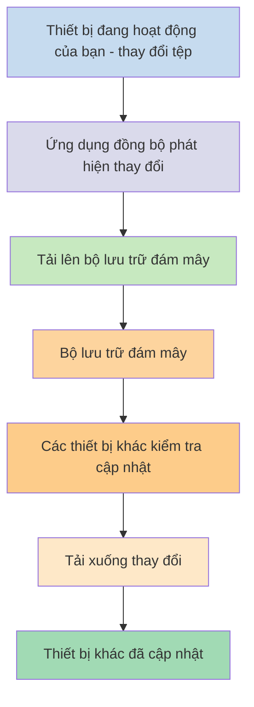
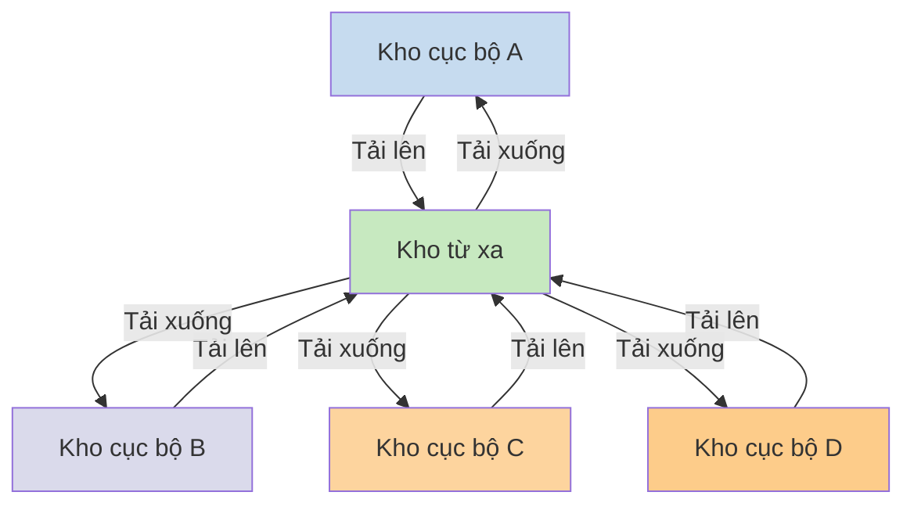

Nếu bạn muốn sử dụng ghi chú trên các thiết bị khác nhau, một trong những lựa chọn bạn có là [[Đồng bộ hóa ghi chú giữa các thiết bị]]. Obsidian cung cấp một dịch vụ như vậy, [[Giới thiệu về Obsidian Sync|Obsidian Sync]], hoạt động khác với các dịch vụ đồng bộ hóa khác, như [[Đồng bộ hóa ghi chú giữa các thiết bị#iCloud|iCloud]] và [[Đồng bộ hóa ghi chú giữa các thiết bị#OneDrive|OneDrive]].

Dưới đây là một số thuật ngữ quan trọng:

- **Kho** là một thư mục trên hệ thống tệp của bạn chứa các ghi chú và một thư mục `.obsidian` với cấu hình dành riêng cho Obsidian.
- **Kho cục bộ** là bản sao kho của bạn tồn tại trên mỗi thiết bị. Khi sử dụng dịch vụ đồng bộ hóa, bạn kết nối các kho cục bộ này để cho phép đồng bộ hóa.
- **Kho từ xa** là bộ lưu trữ tập trung mà các kho cục bộ kết nối trực tiếp thông qua Obsidian Sync.

Có hai cách tiếp cận phổ biến để đồng bộ hóa:

- **[[#Dịch vụ đồng bộ dựa trên tệp]]**: Các kho cục bộ phải nằm trong các thư mục được giám sát, đồng bộ hóa diễn ra thông qua hệ thống tệp
- **[[#Obsidian Sync|Kho từ xa]]**: Bộ lưu trữ tập trung mà các kho cục bộ kết nối trực tiếp thông qua Obsidian

## Dịch vụ đồng bộ dựa trên tệp

Các dịch vụ như Dropbox, Google Drive, iCloud và OneDrive hoạt động dựa trên thư mục. Các dịch vụ này giám sát các thư mục cụ thể và tự động đồng bộ bất kỳ tệp nào được đặt trong đó. Các tệp phải nằm trong các thư mục dịch vụ đám mây được chỉ định để đồng bộ. Với các dịch vụ đồng bộ dựa trên tệp, kho cục bộ của bạn đóng vai trò như một thư mục được giám sát khác. Không có kho từ xa chuyên dụng - thay vào đó, bộ lưu trữ đám mây đóng vai trò trung chuyển, sao chép tệp giữa các kho cục bộ trên các thiết bị khác nhau.

Sơ đồ bên dưới cho thấy phiên bản đơn giản hóa về cách các dịch vụ này hoạt động:

Nếu dịch vụ đám mây có đồng bộ nền, thì một số quy trình này có thể đang diễn ra ngay cả khi bạn không chủ động sử dụng ứng dụng để xem tệp. Các dịch vụ này giám sát các thư mục cụ thể và tự động đồng bộ bất kỳ tệp nào được đặt trong đó. Các tệp phải nằm trong các thư mục dịch vụ đám mây được chỉ định để đồng bộ.

## Obsidian Sync

Obsidian Sync cho phép bạn tạo một kho từ xa đóng vai trò bộ lưu trữ tập trung thông qua dịch vụ [[Giới thiệu về Obsidian Sync|Obsidian Sync]]. Điều này cho phép bạn chọn hầu hết bất kỳ thư mục nào trên bất kỳ thiết bị nào để lưu trữ tệp - cho dù trên ổ cứng ngoài, trong `C:\`, hay trong bộ nhớ ứng dụng trên Android.

Tuy nhiên, chúng tôi có một danh sách các vị trí được đề xuất cho kho cục bộ của bạn nếu bạn cũng sử dụng [[#Dịch vụ đồng bộ dựa trên tệp]] trên cùng một thiết bị - chủ yếu là bất kỳ nơi nào không nằm trong [[Chuyển sang Obsidian Sync#Di chuyển kho của bạn ra khỏi dịch vụ đồng bộ bên thứ ba hoặc bộ lưu trữ đám mây|dịch vụ đồng bộ bên thứ ba]].

Sơ đồ bên dưới cho thấy phiên bản đơn giản hóa về cách Obsidian Sync hoạt động:

Sức mạnh của hệ thống này trở nên rõ ràng hơn với nhiều loại thiết bị. [[#Dịch vụ đồng bộ dựa trên tệp]] có thể được triển khai không nhất quán giữa các hệ điều hành, và thiết bị di động có các quy tắc riêng về cách ứng dụng có thể bị giới hạn sandbox và tiết kiệm pin, điều này khiến các dịch vụ dựa trên tệp truyền thống khó hoạt động liền mạch hơn nhiều.

Với Obsidian Sync, dịch vụ xử lý đồng bộ hóa trực tiếp thông qua ứng dụng, cung cấp hành vi nhất quán bất kể loại thiết bị hay giới hạn hệ điều hành, đồng thời ưu tiên giữ một bản sao cục bộ dữ liệu của bạn như một [[Sao lưu tệp Obsidian của bạn|bản sao lưu mềm]].

### Hành vi đồng bộ hóa

Khi bạn thay đổi tệp trong kho cục bộ, Obsidian Sync phát hiện các thay đổi này và tải chúng lên kho từ xa. Các thiết bị khác kết nối với cùng kho từ xa sau đó sẽ tải xuống các thay đổi này và áp dụng vào kho cục bộ của chúng. Obsidian Sync theo dõi thay đổi ở cấp độ tệp và chỉ truyền các tệp đã được sửa đổi, thay vì đồng bộ toàn bộ thư mục. Điều này giảm băng thông sử dụng và thời gian đồng bộ.

Khi xảy ra xung đột hoặc khi bạn cần kiểm soát tệp nào được đồng bộ, Obsidian Sync cung cấp các cơ chế cụ thể để xử lý các tình huống này:

![[Khắc phục sự cố Obsidian Sync#Giải quyết xung đột|Giải quyết xung đột]]

![[Cài đặt đồng bộ và đồng bộ hóa chọn lọc#Đồng bộ hóa chọn lọc#Loại trừ một thư mục khỏi đồng bộ hóa]]

### Hành vi ngoại tuyến

Các thay đổi được thực hiện khi ngoại tuyến sẽ được xếp hàng đợi và đồng bộ tự động khi thiết bị của bạn kết nối lại internet và Obsidian đang mở. Kho cục bộ của bạn vẫn hoạt động đầy đủ trong thời gian ngoại tuyến.

## Bước tiếp theo

- [[Thiết lập Obsidian Sync]] để bắt đầu với kho từ xa.
- [[Chuyển sang Obsidian Sync]] nếu bạn hiện đang sử dụng đồng bộ dựa trên tệp và muốn sử dụng Obsidian Sync.
- [[Đồng bộ hóa ghi chú giữa các thiết bị|Khám phá các tùy chọn đồng bộ khác]] nếu bạn vẫn đang cân nhắc.
