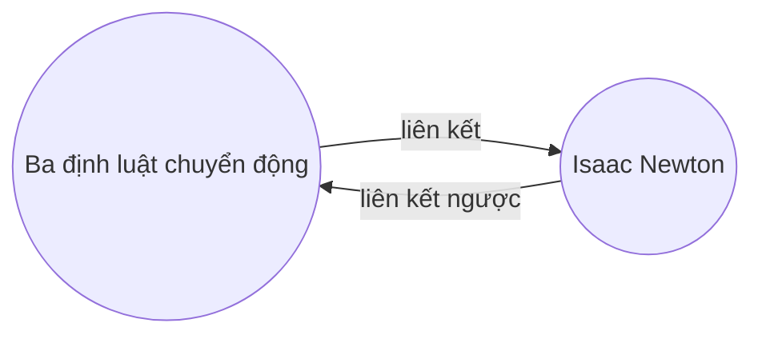

Với [[Plugin cốt lõi|plugin]] Liên kết đến, bạn có thể xem tất cả _liên kết ngược_ cho ghi chú đang hoạt động.

Liên kết ngược của một ghi chú là liên kết từ một ghi chú khác đến ghi chú đó. Trong ví dụ sau, ghi chú "Ba định luật chuyển động" chứa một liên kết đến ghi chú "Isaac Newton". Liên kết ngược tương ứng sẽ liên kết từ "Isaac Newton" trở lại "Ba định luật chuyển động".

Liên kết ngược có thể hữu ích để tìm các ghi chú tham chiếu đến ghi chú bạn đang viết. Hãy tưởng tượng nếu bạn có thể liệt kê các liên kết ngược cho bất kỳ trang web nào trên internet.

## Hiển thị các liên kết trả về

Plugin Liên kết đến hiển thị các liên kết ngược cho các thẻ đang hoạt động. Có hai phần có thể thu gọn: **Lưu ý đã liên kết** và **Lưu ý không liên kết**.

- **Lưu ý đã liên kết** là các liên kết ngược đến các ghi chú chứa liên kết nội bộ đến ghi chú đang hoạt động.
- **Lưu ý không liên kết** là các liên kết ngược đến bất kỳ lần xuất hiện nào chưa được liên kết của tên ghi chú đang hoạt động.

Plugin cung cấp các tùy chọn sau:

- **Thu gọn kết quả** bật/tắt việc mở rộng từng ghi chú để hiển thị các lượt đề cập trong đó.
- **Hiển thị nhiều ngữ cảnh hơn** bật/tắt việc cắt ngắn hoặc hiển thị toàn bộ đoạn văn chứa lượt đề cập.
- **Thay đổi thứ tự sắp xếp** xác định cách sắp xếp các lượt đề cập.
- **Hiển thị bộ lọc tìm kiếm** bật/tắt trường văn bản cho phép bạn lọc các lượt đề cập. Để biết thêm thông tin về cách xây dựng cụm từ tìm kiếm, hãy tham khảo [[Tìm kiếm]].

## Xem liên kết ngược cho một ghi chú

Để xem các liên kết ngược cho ghi chú đang hoạt động, nhấp vào thẻ **Liên kết đến** ![[obsidian-icon-links-coming-in.svg#icon]] trong thanh bên phải.

> [!note] Ghi chú
> Nếu bạn không thể thấy thẻ Liên kết đến, bạn có thể hiển thị nó bằng cách mở [[Khay lệnh]] và chạy lệnh **Liên kết đến: Hiển thị các liên kết trả về**.

> [!info] Tệp bị loại trừ
> Các tệp khớp với mẫu [[Cài đặt#Tệp bị loại trừ|Tệp bị loại trừ]] của bạn sẽ không xuất hiện trong Lưu ý không liên kết.

## Xem liên kết ngược của một ghi chú cụ thể

Thẻ liên kết ngược liệt kê các liên kết ngược cho ghi chú đang hoạt động và cập nhật khi bạn chuyển sang ghi chú khác. Nếu bạn muốn xem các liên kết ngược cho một ghi chú cụ thể, bất kể ghi chú đó có đang hoạt động hay không, bạn có thể mở thẻ liên kết ngược _được liên kết_.

Để mở thẻ liên kết ngược được liên kết:

1. Mở [[Khay lệnh]].
2. Chọn **Liên kết đến: Mở liên kết đến cho tệp hiện tại**.

Một thẻ riêng biệt sẽ mở bên cạnh ghi chú đang hoạt động của bạn. Thẻ hiển thị biểu tượng liên kết để cho bạn biết nó được liên kết với một ghi chú.

## Hiển thị liên kết ngược trong ghi chú

Thay vì hiển thị các liên kết ngược trong một thẻ riêng biệt, bạn có thể hiển thị các liên kết ngược ở cuối ghi chú của mình.

Để hiển thị liên kết ngược trong ghi chú:

1. Mở [[Khay lệnh]].
2. Chọn **Liên kết đến: Bật/tắt liên kết đến trong tài liệu**.

Hoặc, bật **Liên kết đến trong tài liệu** trong tùy chọn plugin Liên kết đến để tự động bật/tắt liên kết ngược khi bạn mở ghi chú mới.
