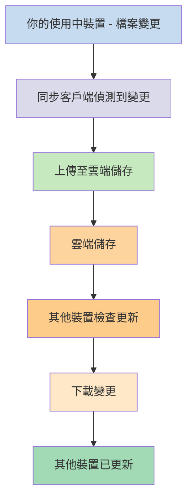
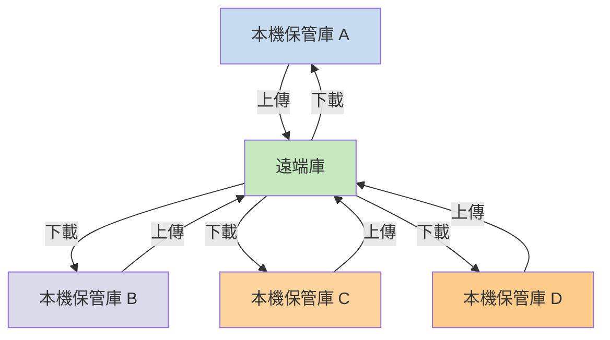

如果你想在不同裝置上使用筆記，其中一個選項是[[跨裝置同步筆記]]。Obsidian 提供了一項名為 [[Obsidian Sync 簡介|Obsidian Sync]] 的服務，其運作方式與其他同步服務不同，例如 [[跨裝置同步筆記#iCloud|iCloud]] 和 [[跨裝置同步筆記#OneDrive|OneDrive]]。

以下是一些關鍵術語：

- **保管庫**是檔案系統中的一個資料夾，其中包含筆記和帶有 Obsidian 特定設定的 `.obsidian` 資料夾。
- **本機保管庫**是存在於你每個裝置上的保管庫副本。使用同步服務時，你可以連接這些本機保管庫以啟用同步功能。
- **遠端庫**是集中式儲存空間，本機保管庫可透過 Obsidian Sync 直接連接到它。

同步有兩種常見方式：

- **[[#檔案型同步服務]]**：本機保管庫必須位於受監控的資料夾中，同步透過檔案系統進行
- **[[#Obsidian Sync|遠端庫]]**：集中式儲存空間，本機保管庫透過 Obsidian 直接連接

## 檔案型同步服務

Dropbox、Google Drive、iCloud 和 OneDrive 等服務是基於資料夾的。這些服務會監控特定資料夾，並自動同步其中的所有檔案。檔案必須放在指定的雲端服務資料夾中才能同步。使用檔案型同步服務時，你的本機保管庫只是被監控的另一個資料夾。沒有專用的遠端庫——雲端儲存空間充當中轉站，在不同裝置的本機保管庫之間複製檔案。

下圖展示了這些服務運作方式的簡化版本：

如果雲端服務支援背景同步，那麼即使你沒有主動使用應用程式來檢視檔案，其中某些程序也可能在運作中。這些服務會監控特定資料夾，並自動同步其中的所有檔案。檔案必須放在指定的雲端服務資料夾中才能同步。

## Obsidian Sync

Obsidian Sync 允許你透過其 [[Obsidian Sync 簡介|Obsidian Sync]] 服務建立一個作為集中式儲存空間的遠端庫。這讓你幾乎可以在任何裝置上選擇任何資料夾來儲存檔案——無論是外接硬碟、`C:\`，還是 Android 上的應用程式儲存空間。

但是，如果你同時在同一裝置上使用[[#檔案型同步服務]]，我們有一份本機保管庫的推薦位置清單——主要是不在[[切換至 Obsidian Sync#將保管庫移出第三方同步服務或雲端儲存|第三方同步服務]]中的任何位置。

下圖展示了 Obsidian Sync 運作方式的簡化版本：

當裝置類型越多，這個系統的優勢就越明顯。[[#檔案型同步服務]]在不同作業系統上的實作可能不一致，而行動裝置對應用程式的沙盒化和電源限制也有各自的規則，這使得傳統的檔案型服務更難實現無縫運作。

透過 Obsidian Sync，同步服務直接透過應用程式處理同步，無論裝置類型或作業系統限制如何，都能提供一致的行為，同時優先保留資料的本機副本作為[[備份你的 Obsidian 檔案|軟備份]]。

### 同步行為

當你在本機保管庫中修改檔案時，Obsidian Sync 會偵測到這些變更並將其上傳到遠端庫。連接到相同遠端庫的其他裝置隨後會下載這些變更並套用到各自的本機保管庫。Obsidian Sync 在檔案層級追蹤變更，僅傳輸已修改的檔案，而非同步整個資料夾。這減少了頻寬使用和同步時間。

當發生衝突或需要控制哪些檔案進行同步時，Obsidian Sync 提供了特定機制來處理這些情況：

![[Obsidian Sync 疑難排解#衝突解決|衝突解決]]

![[同步設定與選擇性同步#選擇性同步#排除資料夾不進行同步]]

### 離線行為

離線時所做的變更會排入佇列，當裝置重新連接網路且 Obsidian 開啟時會自動同步。在離線期間，你的本機保管庫仍可完全正常運作。

## 後續步驟

- [[設定 Obsidian Sync]] 以開始使用遠端庫。
- [[切換至 Obsidian Sync]]，如果你目前使用檔案型同步且想改用 Obsidian Sync。
- [[跨裝置同步筆記|探索其他同步選項]]，如果你還在考慮中。
