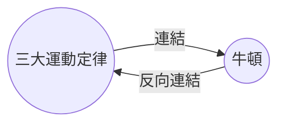

透過[[核心外掛程式|反向連結外掛]]，你可以查看目前筆記的所有_反向連結_。

一則筆記的反向連結是指從另一則筆記連結到該筆記的連結。在以下範例中，「三大運動定律」筆記包含一個指向「牛頓」筆記的連結。對應的反向連結則會從「牛頓」連回「三大運動定律」。

反向連結可以幫助你找到引用了你正在撰寫之筆記的其他筆記。想像一下，如果你能列出網路上任何網站的反向連結，那會多有用。

## 顯示反向連結

反向連結外掛會顯示目前分頁的反向連結。其中有兩個可摺疊的區段：**已連結本筆記的檔案**和**提及的未連結**。

- **已連結本筆記的檔案**是指包含指向目前筆記之內部連結的筆記反向連結。
- **提及的未連結**是指任何未以連結形式出現但提及目前筆記名稱的反向連結。

它提供以下選項：

- **摺疊搜尋結果**可切換是否展開每則筆記以顯示其中的提及。
- **顯示更多內容**可切換是否截斷或完整顯示包含提及的段落。
- **排序**可決定如何排列提及內容。
- **顯示搜尋過濾內容**可切換一個文字欄位，讓你篩選提及內容。如需了解如何建立搜尋條件，請參閱[[搜尋]]。

## 檢視筆記的反向連結

若要檢視目前筆記的反向連結，請點選右側邊欄中的**反向連結** ![[obsidian-icon-links-coming-in.svg#icon]] 分頁。

> [!note] 備註
> 如果你看不到反向連結分頁，可以開啟[[命令面板]]並執行**反向連結：顯示反向連結**命令來讓它顯示。

> [!info] 已排除的檔案
> 符合你[[設定#已排除的檔案|已排除的檔案]]模式的檔案不會出現在提及的未連結中。

## 查看特定筆記的反向連結

反向連結分頁會列出目前筆記的反向連結，並在你切換到其他筆記時自動更新。如果你想查看某則特定筆記的反向連結，無論該筆記是否處於啟用狀態，你可以開啟一個_連結的_反向連結分頁。

若要開啟連結的反向連結分頁：

1. 開啟[[命令面板]]。
2. 選擇**反向連結：顯示目前筆記的相關連結**。

一個獨立的分頁會在你目前筆記旁邊開啟。該分頁會顯示一個連結圖示，讓你知道它已連結到某則筆記。

## 在筆記中顯示反向連結

除了在獨立分頁中顯示反向連結之外，你也可以在筆記底部直接顯示反向連結。

若要在筆記中顯示反向連結：

1. 開啟[[命令面板]]。
2. 選擇**反向連結：在文件中切換反向連結**。

或者，在反向連結外掛程式選項中啟用**檔案中的反向連結**，即可在開啟新筆記時自動切換反向連結。
