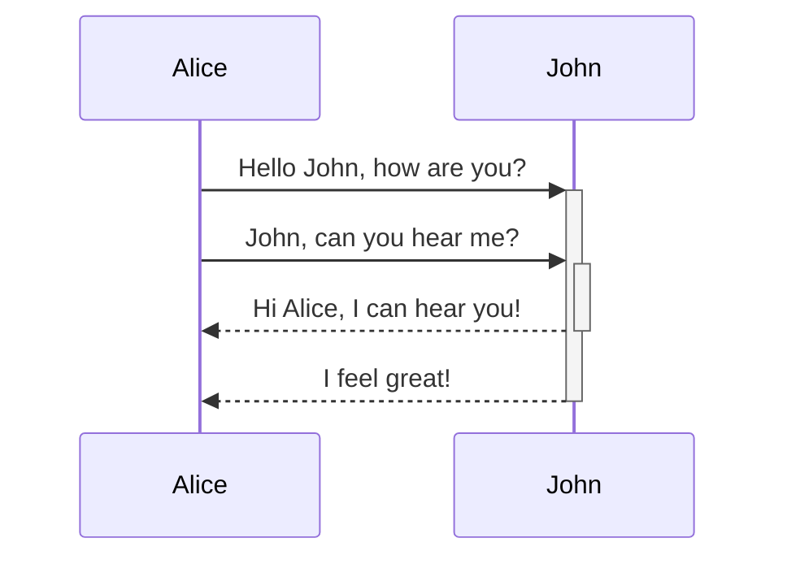
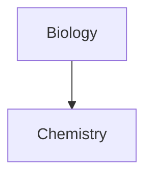

了解如何在筆記中加入進階格式語法。

## 表格

你可以使用垂直線（`|`）分隔直欄，並使用連字號（`-`）定義標題列來建立表格。以下是範例：

```md
| First name | Last name |
| ---------- | --------- |
| Max        | Planck    |
| Marie      | Curie     |
```

| First name | Last name |
| ---------- | --------- |
| Max        | Planck    |
| Marie      | Curie     |

雖然表格兩側的垂直線是可選的，但為了可讀性建議加上。

> [!tip] 在_即時預覽_中，你可以右鍵點擊表格來新增或刪除直欄和橫列。你也可以使用右鍵選單來排序和移動它們。

你可以透過[[命令面板]]的**插入表格**命令，或右鍵點擊並選擇_插入 → 表格_來插入表格。這會給你一個基本的可編輯表格：

```md
|     |     |
| --- | --- |
|     |     |
```

請注意，儲存格不需要完美對齊，但標題列必須包含至少兩個連字號：

```md
First name | Last name
-- | --
Max | Planck
Marie | Curie
```


### 在表格內設定內容格式

你可以使用[[基本格式語法]]來設定表格內容的樣式。

| First column       | Second column                           |
| ------------------ | --------------------------------------- |
| [[內部連結]] | 連結到你**保管庫**_內_的檔案。 |
| [[嵌入檔案]]    | ![[Engelbart.jpg\|100]]                 |

> [!note] 表格中的垂直線
> 如果你想使用[[別名]]，或在表格中[[基本格式語法#外部圖片|調整圖片大小]]，你需要在垂直線前加上 `\`。
>
> ```md
> First column | Second column
> -- | --
> [[基本格式語法\|Markdown 語法]] | ![[Engelbart.jpg\|200]]
> ```
>
> First column | Second column
> -- | --
> [[基本格式語法\|Markdown 語法]] | ![[Engelbart.jpg\|200]]

透過在標題列新增冒號（`:`）來對齊直欄中的文字。你也可以在_即時預覽_中透過右鍵選單對齊內容。

```md
Left-aligned text | Center-aligned text | Right-aligned text
:-- | :--: | --:
Content | Content | Content
```

Left-aligned text | Center-aligned text | Right-aligned text
:-- | :--: | --:
Content | Content | Content

## 圖表

你可以使用 [Mermaid](https://mermaid-js.github.io/) 在筆記中加入圖表和圖形。Mermaid 支援多種圖表類型，例如[流程圖](https://mermaid.js.org/syntax/flowchart.html)、[序列圖](https://mermaid.js.org/syntax/sequenceDiagram.html)和[時間軸](https://mermaid.js.org/syntax/timeline.html)。

> [!tip] 小技巧
> 你也可以嘗試 Mermaid 的[線上編輯器](https://mermaid-js.github.io/mermaid-live-editor)，在將圖表加入筆記之前先行建立。

要加入 Mermaid 圖表，請建立一個 `mermaid` [[基本格式語法#程式碼區塊|程式碼區塊]]。

````md

````


````md

````


### 在圖表中連結檔案

你可以透過將 `internal-link` [類別](https://mermaid.js.org/syntax/flowchart.html#classes)附加到節點，在圖表中建立[[內部連結]]。

````md

````


> [!note] 備註
> 圖表中的內部連結不會顯示在[[關聯圖檢視]]中。

如果你的圖表中有許多節點，可以使用以下片段。

````md

````

這樣，每個字母節點都會變成內部連結，以[節點文字](https://mermaid.js.org/syntax/flowchart.html#a-node-with-text)作為連結文字。

> [!note] 備註
> 如果你的筆記名稱中使用了特殊字元，需要將筆記名稱放在雙引號中。
>
> ```
> class "⨳ special character" internal-link
> ```
>
> 或者，`A["⨳ special character"]`。

有關建立圖表的更多資訊，請參閱 [Mermaid 官方文件](https://mermaid.js.org/intro/)。

## 公式

你可以使用 [MathJax](http://docs.mathjax.org/en/latest/basic/mathjax.html) 和 LaTeX 標記法在筆記中加入數學公式。

要在筆記中加入 MathJax 公式，請用雙錢號（`$$`）包圍它。

```md
$$
\begin{vmatrix}a & b\\
c & d
\end{vmatrix}=ad-bc
$$
```

$$
\begin{vmatrix}a & b\\
c & d
\end{vmatrix}=ad-bc
$$

你也可以用 `$` 符號包裹行內數學公式。

```md
這是一個行內數學公式 $e^{2i\pi} = 1$。
```

這是一個行內數學公式 $e^{2i\pi} = 1$。

有關語法的更多資訊，請參閱 [MathJax 基礎教學與快速參考](https://math.meta.stackexchange.com/questions/5020/mathjax-basic-tutorial-and-quick-reference)。

有關支援的 MathJax 套件列表，請參閱 [TeX/LaTeX 擴展列表](http://docs.mathjax.org/en/latest/input/tex/extensions/index.html)。
