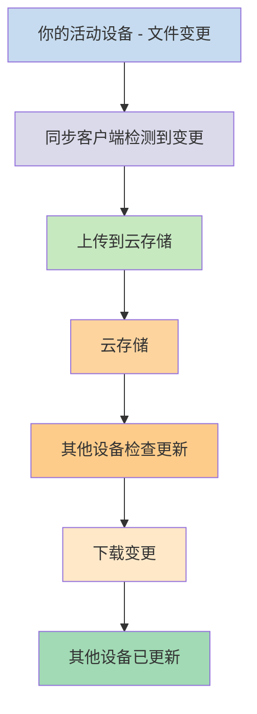
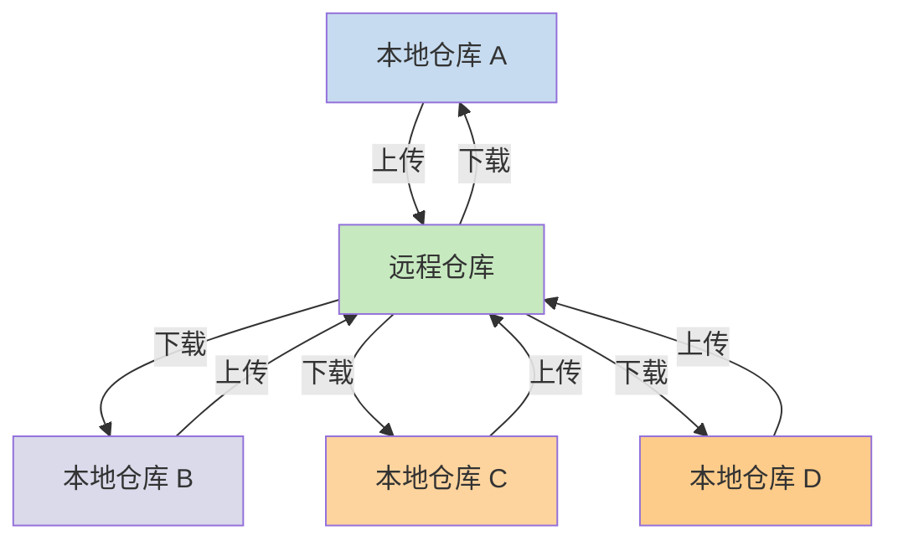

---
aliases:
  - Local and remote vaults
  - 远程仓库
  - 本地仓库
  - Obsidian 同步服务/本地仓库与远程仓库
permalink: sync/vault-types
cssclasses:
  - soft-embed
publish: true
mobile: true
description: 本页介绍了本地仓库和远程仓库在实际使用中的区别。
---
如果你想在不同设备上使用笔记，其中一个选择是[[同步笔记|跨设备同步笔记]]。Obsidian 提供了一项这样的服务——[[Obsidian 官方同步简介|Obsidian Sync]]，它的工作方式与其他同步服务不同，例如 [[同步笔记#iCloud|iCloud]] 和 [[同步笔记#OneDrive|OneDrive]]。

以下是一些关键术语：

- **仓库**是文件系统中的一个文件夹，其中包含笔记和一个 `.obsidian` 文件夹（用于存放 Obsidian 特有的配置）。
- **本地仓库**是仓库在你每台设备上的副本。使用同步服务时，你需要连接这些本地仓库以实现同步。
- **远程仓库**是集中存储，本地仓库通过 Obsidian Sync 直接连接到远程仓库。

同步有两种常见方式：

- **[[#基于文件的同步服务]]**：本地仓库必须位于被监控的文件夹中，同步通过文件系统进行
- **[[#Obsidian Sync|远程仓库]]**：集中存储，本地仓库通过 Obsidian 直接连接

## 基于文件的同步服务

Dropbox、Google Drive、iCloud 和 OneDrive 等服务是基于文件夹的。这些服务监控特定文件夹并自动同步其中的文件。文件必须位于指定的云服务文件夹中才能同步。使用基于文件的同步服务时，你的本地仓库只是被监控的另一个文件夹。没有专门的远程仓库——云存储只是充当中转站，在不同设备的本地仓库之间复制文件。

下图展示了这些服务工作方式的简化版本：

如果云服务支持后台同步，那么即使你没有主动使用应用查看文件，其中一些过程也可能在后台进行。这些服务监控特定文件夹并自动同步其中的文件。文件必须位于指定的云服务文件夹中才能同步。

## Obsidian Sync

Obsidian Sync 允许你通过其 [[Obsidian 官方同步简介|Obsidian Sync]] 服务创建一个作为集中存储的远程仓库。这使你可以在任何设备上选择几乎任何文件夹来存储文件——无论是外部硬盘、`C:\` 还是 Android 上的应用存储。

但是，如果你在同一设备上还使用[[#基于文件的同步服务]]，我们有一份本地仓库的推荐位置列表——主要是不在[[切换到 Obsidian Sync#将仓库移出第三方同步服务或云存储|第三方同步服务]]文件夹中的任何位置。

下图展示了 Obsidian Sync 工作方式的简化版本：

这个系统的优势在设备类型越多时越明显。[[#基于文件的同步服务]]在不同操作系统上的实现可能不一致，而移动设备对应用的沙盒化和功耗限制有自己的规则，这使得传统的基于文件的服务更难实现无缝同步。

通过 Obsidian Sync，同步服务直接在应用内处理，无论设备类型或操作系统限制如何，都能提供一致的行为，同时优先保留数据的本地副本作为[[备份笔记|软备份]]。

### 同步行为

当你在本地仓库中修改文件时，Obsidian Sync 会检测这些变更并将其上传到远程仓库。连接到同一远程仓库的其他设备随后会下载这些变更并应用到各自的本地仓库。Obsidian Sync 在文件级别跟踪变更，仅传输已修改的文件，而不是同步整个文件夹。这减少了带宽使用和同步时间。

当发生冲突或需要控制哪些文件进行同步时，Obsidian Sync 提供了特定的机制来处理这些情况：

![[官方同步故障排查指南#冲突解决方式|冲突解决方式]]

![[同步文件和设置#选择性同步#从同步中排除文件夹]]

### 离线行为

离线时所做的更改会被排入队列，当设备重新连接到互联网且 Obsidian 处于打开状态时会自动同步。在离线期间，你的本地仓库仍然完全可用。

## 后续步骤

- [[启动同步服务]]，开始使用远程仓库。
- [[切换到 Obsidian Sync]]，如果你目前使用基于文件的同步并希望改用 Obsidian Sync。
- [[同步笔记|了解其他同步选项]]，如果你仍在做决定。
