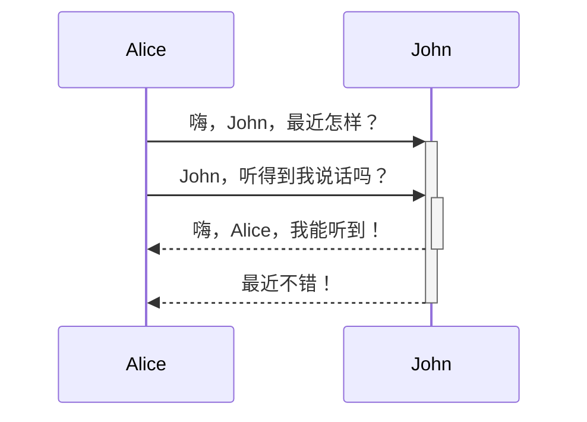

Obsidian 是一个基于 Markdown 进行记录的知识库软件。

目前 Obsidian 支持的格式如下：

---

### 内部链接

通过`[[]]`来链接库中任意一个文件。

```md
链接一篇笔记：[[内部链接]]。
```

链接一篇笔记：[[内部链接]]。

---

### 嵌入文件

在笔记中插入其他文件（更多细节请阅读[[嵌入文件]]）。这里将演示如何插入一篇笔记的某个章节：

```md
![[Obsidian#什么是 Obsidian]]
```

![[Obsidian#什么是 Obsidian]]

---

### 小标题

```md
# 这是小标题 1
## 这是小标题 2
### 这是小标题 3 
#### 这是小标题 4
##### 这是小标题 5
###### 这是小标题 6
```

# 这是小标题 1
## 这是小标题 2
### 这是小标题 3 
#### 这是小标题 4
##### 这是小标题 5
###### 这是小标题 6

---

### 强调

```md
*这是斜体示例*
_这是斜体的另一种写法_
```

*这是斜体示例*
_这是斜体的另一种写法_

```md
**这是粗体示例**
__这是粗体的另一种写法__
```

**这是粗体示例**
__这是粗体的另一种写法__

```md
_你也**可以**将它们配合使用_
```

_你也**可以**将它们配合使用_

---

### 列表

```md
- 项目 1
- 项目 2
	- 项目 2a
	- 项目 2b

1. 项目 1
1. 项目 2
1. 项目 3
   1. 项目 3a
   1. 项目 3b
```

无序列表：
- 项目 1
- 项目 2
	- 项目 2a
	- 项目 2b

有序列表：
1. 项目 1
1. 项目 2
1. 项目 3
	1. 项目 3a
	2. 项目 3b

--- 

### 图片

```md

```


#### 调整图片大小

比如，将上面的示例图片调整为100像素宽：

```md

```


---

### 其他链接

#### 外部链接

Markdown 风格的链接既可以用来指向网页这类外部对象，也可以用来指向库中的笔记或者图片。

```md
http://obsidian.md - automatic!
[Obsidian](http://obsidian.md)
```

http://obsidian.md - 自动化!
[Obsidian](http://obsidian.md)

#### Obsidian URI

[[使用 Obsidian URI|Obsidian URI]] 可以让你在其他应用或 Obsidian 的其他库中打开当前库的某篇笔记。

比如，你可以通过以下方式跳转到某个库中的某篇笔记（请注意 [[使用 Obsidian URI#编码|URI 的编码]]）：

```md
[打开某篇笔记](obsidian://open?path=D:%2Fpath%2Fto%2Ffile.md)
```

[打开某篇笔记](obsidian://open?path=D:%2Fpath%2Fto%2Ffile.md)

除了通过笔记的地址来链接笔记外，你也可以通过笔记所在的库名称以及笔记名称来链接该笔记：

```md
[打开某篇笔记](obsidian://open?vault=MainVault&file=MyNote.md)
```

[打开某篇笔记](obsidian://open?vault=MainVault&file=MyNote.md)

#### 转义

如果 url 中含有空格的话，空格需要转义为 `%20`，如：

```md
[Export options](Pasted%20image)
```

[Export options](Pasted%20image)

当然，你也可以用 `<>` 将空格包含起来，如：

```md
[Slides Demo](<Slides Demo>)
```

[Slides Demo](<Slides Demo>)

---

### 引用

```md
> Human beings face ever more complex and urgent problems, and their effectiveness in dealing with these problems is a matter that is critical to the stability and continued progress of society.

\- Doug Engelbart, 1961
```

> Human beings face ever more complex and urgent problems, and their effectiveness in dealing with these problems is a matter that is critical to the stability and continued progress of society.

\- Doug Engelbart, 1961

---

### 行内代码

```md
一行中被 `反引号` 括起来的文字会以代码格式显示。
```

一行中被 `反引号` 括起来的文字会以代码格式显示。

---

### 代码块

Obsidian 会将六个反引号括起来的内容识别为代码块，并将其按代码格式显示。代码块支持语法高亮功能，你可以在代码块的第一行（即开头处的反引号后）声明语言来使用特定的语法高亮。

代码块的语法高亮实际是使用 prismjs 来实现的，因此你可以到[他们的网站](https://prismjs.com/#supported-languages) 来查看其支持的语言。

<pre><code>```js
function fancyAlert(arg) {
  if(arg) {
    $.facebox({div:'#foo'})
  }
}
```</code></pre>

```js
function fancyAlert(arg) {
  if(arg) {
    $.facebox({div:'#foo'})
  }
}
```

```md
    如果你使用 Tab 键对段落进行缩进，这段文本在预览模式下也会被识别为代码块。
```

	
	如果你使用 Tab 键对段落进行缩进，这段文本在预览模式下也会被识别为代码块。
	
---

### 任务列表

```md
- [x] 支持 #标签 ，[链接]()，**样式**
- [x] 要求包含列表标志（有序表无序表均可，比如 `1.[x]` 同样可以）
- [x] 这是一个已经完成的项目
- [?] 这也是一个已完成的项目（实际上你可以在其中使用任何字符）
- [ ] 这是一个未完成的项目
- [ ] 在预览模式下单击选框可以切换项目完成状态
```

- [x] 支持 #标签 ，[链接]()，**样式**
- [x] 要求包含列表标志（有序表无序表均可，比如 `1.[x]` 同样可以）
- [x] 这是一个已经完成的项目
- [?] 这也是一个已完成的项目（实际上你可以在其中使用任何字符）
- [ ] 这是一个未完成的项目 
- [ ] 在预览模式下单击选框可以切换项目完成状态

---

### 表格

你可以使用 `-` 来分割表格的标题行和内容行，使用 `|` 来指定不同的列：

```md
| 标题1          | 标题2          |
| -------------- | -------------- |
| 单元格11的内容 | 单元格12的内容 |
| 单元格21的内容 | 单元格22的内容 |
```

| 标题1          | 标题2          |
| -------------- | -------------- |
| 单元格11的内容 | 单元格12的内容 |
| 单元格21的内容 | 单元格22的内容 |

---

| 列宽可以通过冒号来进行调整 | 这样你就可以在标题行中输入长标题 |
| :------------------------- | -------------------------------: |
| 因为 `:` 的存在            |             不同列将有不同的列宽 |

你可以在表格中添加链接，因为链接能在表格中正确显示。但如果你的链接中包含 `|`，则需要对其进行转义（用 `\|` 代替 `|`），以防止链接中的竖线被错误识别为列分隔符。

如果你在列表中添加链接，他们可以正常的显示与使用。但如果使用的是竖线链接，则需要在竖线前面加上 `\` 来进行转义，防止表格错乱。

```md
| 标题1                      | 标题2              |
| -------------------------- | ------------------ |
| [[格式化你的笔记\|格式化]] | [[快捷键\|快捷键]] |
```

| 标题1                      | 标题2              |
| -------------------------- | ------------------ |
| [[格式化笔记\|格式化]] | [[使用快捷键\|快捷键]] |

---

### 删除线

```md
在文字两端加上波浪线将会显示为删除效果，比如~~这样~~。
```

在文字两端加上波浪线将会显示为删除效果，比如~~这样~~。

---

###  高亮

```md
使用两个等号来对文本进行高亮==文本==。
```

使用两个等号来对文本进行高亮==文本==。

---

### 脚注

```md
H脚注的用法很简单，只需要在段落中需要插入脚注的地方标注一个符号，再在段落后对这个符号进行解释即可。比如这是一个简单的脚注，[^1] 这是一个长一些的脚注。[^长脚注]

[^1]: 很有用！
[^长脚注]: 这是一个可以写长段落或者代码的地方。
	
	你可以使用缩进在脚注中纳入其他段落。
	
	`{ 代码 }`

	这样你就可以在脚注中添加任意数量的段落了。
```

脚注的用法很简单，只需要在段落中需要插入脚注的地方标注一个符号，再在段落后对这个符号进行解释即可。比如这是一个简单的脚注，[^1] 这是一个长一些的脚注。[^长脚注]

[^1]: 很有用！
[^长脚注]: 这是一个可以写长段落或者代码的地方。
	
	你可以使用缩进在脚注中纳入其他段落。
	
	`{ 代码 }`

	这样你就可以在脚注中添加任意数量的段落了。
	
你也可以使用行内脚注。^[请注意符号^需要在方括号外]

### 数学公式

```md
$$\begin{vmatrix}a & b\\
c & d
\end{vmatrix}=ad-bc$$
```

$$\begin{vmatrix}a & b\\
c & d
\end{vmatrix}=ad-bc$$

你也可以像这样 $e^{2i\pi} = 1$ 使用行内公式。

这里的公式使用的是 LaTeX 语法，你可以到相应网站了解更多相关信息。

### 注释

所谓注释，指的是会在编辑模式中显示，但不会在预览模式中显示的内容。使用 `%%` 可以将内容变为注释。以下为语法：

```md
这里是行内注释：%%预览模式下你将看不到这句话%%

这里是跨行注释：
%%
所谓跨行
就是可以有很多行
%%
```

以下为示例：

这里是行内注释：%%预览模式下你将看不到这句话%%

这里是跨行注释：
%%
所谓跨行
就是可以有很多行
%%

### 图表

Obsidian 通过 [Mermaid](https://mermaid-js.github.io/) 及其所提供的[编译器](https://mermaid-js.github.io/mermaid-live-editor)来为用户提供图表的绘制功能。

<pre><code>```mermaid
sequenceDiagram
    Alice->>+John: 嗨，John，最近怎样？
    Alice->>+John: John，听得到我说话吗？
    John-->>-Alice: 嗨，Alice，我能听到！
    John-->>-Alice: 最近不错！
```</code></pre>



## 开发小记

总的来说，我们在努力让 Obsidian 的语法不偏离正统的 Markdown 语法太多。总的来看，Obsidian 的语法大多还是基于 CommonMark，包括了一些 GitHub Flavored Markdown（GFM）和 LaTeX，以及我们特有的嵌入文件语法。