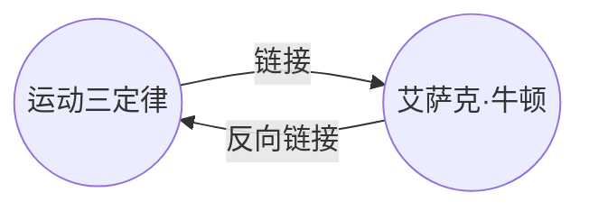

---
aliases:
  - How to/Working with backlinks
  - Backlinks
---

使用反向链接插件，你可以查看当前笔记的所有_反向链接_。

一篇笔记的反向链接是指从另一篇笔记中指向该笔记的链接。在下面的例子中，《运动三定律》笔记包含一个指向《艾萨克·牛顿》笔记的链接。站在《艾萨克·牛顿》的视角看到，这个链接就是反向链接。

反向链接对于查找引用了当前笔记的笔记非常有用。

## 显示反向链接

反向链接插件会显示当前标签页中笔记的反向链接。这包括了部分：**链接当前文件**和**提到当前文件名**。

- **链接当前文件**是指那些确实链接了当前文件的笔记。
- **提到当前文件名**是提到了当前文件名称、但尚未链接当前文件的笔记。

对于这些笔记，插件提供以下选择：

- **折叠**：你可以选择是否展开查看这两个部分包含的笔记。
- **显示更多上下文**：你可以选择是否完整显示包含当前文件名的段落。
- **更改排序顺序**：选择笔记的排列顺序。
- **过滤**：通过输入检索式，进一步过滤展示的笔记。有关如何构建检索式的更多信息，请参阅[[搜索]]。

## 查看文件的反向链接

要查看当前文件的反向链接，请点击右侧边栏中的**反向链接列表**（链接和箭头图标）标签页。

> [!注意]
> 如果你看不到反向链接标签页，可以通过打开[[命令面板]]并运行**反向链接: 显示反向链接标签页**命令来使其可见。

## 在新标签页中查看反向链接列表

反向链接列表一般在右边栏的标签页显示。如果你想在主区域中打开反向链接列表，则可以对当前文件打开一个_关联的_反向链接标签页。

要打开一个新的反向链接标签页：

1. 打开[[命令面板]]。
2. 选择**反向链接: 在新标签页中打开反向链接列表**。

随后，Obsidian 会在当前标签页右边打开一个新的标签组，其中包含了一个显示反向链接列表的标签页。同时该标签页里显示了链接图标，以便让你知道它与某个笔记关联。

## 在标签页中显示反向链接

与在单独的标签页中显示反向链接列不同，你可以将反向链接显示在你的笔记底部。

要在笔记中显示反向链接：

1. 打开[[命令面板]]。
2. 选择**反向链接: 在标签页中显示反向链接**。

或者，在反向链接插件选项下启用**在标签页中显示反向链接**选项。此后在打开新笔记时标签页底部将自动显示反向链接。