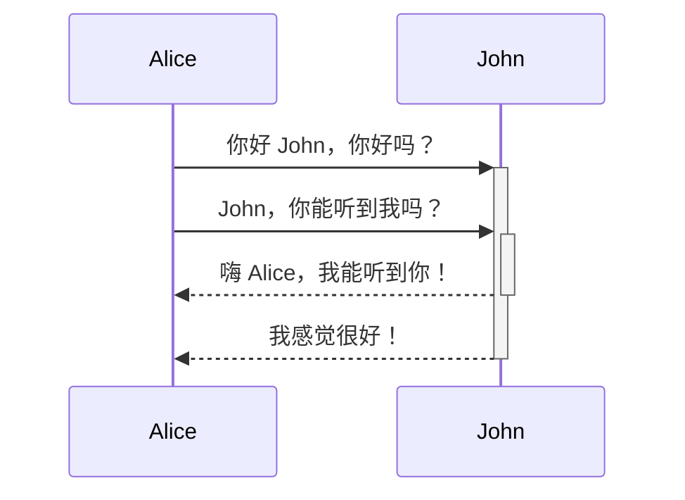
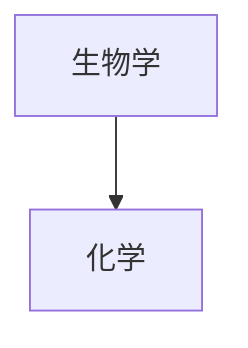

---
aliases:
  - Advanced formatting syntax
---

本篇将向你介绍如何在笔记中使用高级格式语法。

## 表格

你可以使用竖线（`|`）和短横线（`-`）来创建表格。竖线用于分隔列，短横线用于定义列标题。

```md
| 名字 | 姓氏 |
| ---- | ---- |
| 麦克斯 | 普朗克 |
| 玛丽 | 居里 |
```

| 名字 | 姓氏 |
| ---- | ---- |
| 麦克斯 | 普朗克 |
| 玛丽 | 居里 |

表格两侧的竖线是可选的。

单元格不需要与列完全对齐。每个标题行至少要有两个短横线。

```md
名字 | 姓氏
-- | --
麦克斯 | 普朗克
玛丽 | 居里
```

### 格式化表格内容

你可以使用[[基本格式语法]]来为表格内的内容添加基本样式。

第一列 | 第二列
-- | --
[[内部链接]] | 链接到**vault**内的文件。
[[插入文件]] | 直接嵌入库内文件

> [!note] 表格中的竖线
> 如果你想在表格中使用[[别名]]，或者在表格中[[基本格式语法|调整图片大小]]，你需要在竖线前加上 `\` 以防止符号错误识别。
>
> ```md
> 第一列 | 第二列
> -- | --
> [[Basic formatting syntax\|Markdown 语法]] | ![[og-image.png\|200]]
> ```
>
> 第一列 | 第二列
> -- | --
> [[基本格式语法\|Markdown 语法]] | ![[og-image.png\|200]]

通过在标题行中添加冒号（`:`），你可以将文本左对齐、居中或右对齐。

```md
左对齐文本 | 居中文本 | 右对齐文本
:-- | :--: | --:
内容 | 内容 | 内容
```

左对齐文本 | 居中文本 | 右对齐文本
:-- | :--: | --:
内容 | 内容 | 内容

## 图表

你可以使用 [Mermaid](https://mermaid-js.github.io/) 语法在笔记中添加图表和流程图。Mermaid 支持多种图表，如[流程图](https://mermaid.js.org/syntax/flowchart.html)、[时序图](https://mermaid.js.org/syntax/sequenceDiagram.html)和[时间线](https://mermaid.js.org/syntax/timeline.html)等。

> [!tip]
> 你也可以尝试使用 Mermaid 的 [在线编辑器](https://mermaid-js.github.io/mermaid-live-editor) 来帮助你在笔记中添加图表。

要添加 Mermaid 图表，创建一个 `mermaid` [[基本格式语法|代码块]]。

````md

````


````md

````


### 在图表中添加链接

你可以通过将节点声明为 `internal-link` [类型](https://mermaid.js.org/syntax/flowchart.html#classes) 来在图表中创建[[内部链接]]。

````md

````


> [!note]
> 图表中的内部链接不会显示在 [[关系图谱]]中。

如果你的图表中有很多节点，你可以使用以下代码片段。

````md

````

这样，每个字母节点都会成为一个内部链接，[节点文本](https://mermaid.js.org/syntax/flowchart.html#a-node-with-text)将作为链接文本。

> [!note]
> 如果你的笔记名称中包含特殊字符，你需要将笔记名称放在双引号中。
>
> ```
> class "⨳ 特殊字符" internal-link
> ```
>
> 或者 `A["⨳ 特殊字符"]`。

想了解更多有关创建图表的信息，请参阅[Mermaid 官方文档](https://mermaid.js.org/intro/)。

## 数学公式

你可以使用 [MathJax](http://docs.mathjax.org/en/latest/basic/mathjax.html) 和 LaTeX 符号在笔记中添加数学公式。

要在笔记中添加 MathJax 公式，请用双美元符号（`$$`）将其括起来。

```md
$$
\begin{vmatrix}a & b\\
c & d
\end{vmatrix}=ad-bc
$$
```

$$
\begin{vmatrix}a & b\\
c & d
\end{vmatrix}=ad-bc
$$

你也可以用 `$` 符号包裹数学公式来实现行内数学公式。

```md
这是一个行内数学表达式 $e^{2i\pi} = 1$。
```

这是一个行内数学表达式 $e^{2i\pi} = 1$。

想了解更多有关语法的信息，请参阅[MathJax 基础教程](https://math.meta.stackexchange.com/questions/5020/mathjax-basic-tutorial-and-quick-reference)。

要查看支持的 MathJax 包列表，请参阅[TeX/LaTeX 扩展列表](http://docs.mathjax.org/en/latest/input/tex/extensions/index.html)。